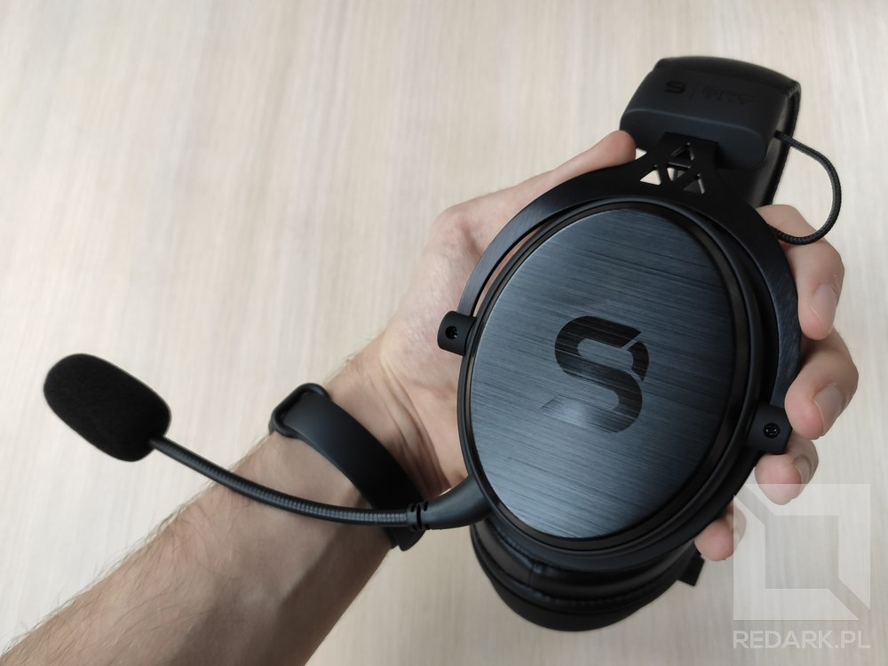

Dziś przygotowałem dla Was test dwóch produktów od firmy SPC - słuchawek Viro oraz myszy LIX. Oba urządzenia są wygraną w konkursie programistycznym zorganizowanym przez Piotra Siemieniuka, który na [Instagramie](https://www.instagram.com/piotr.programista/) oraz [TikToku](https://www.tiktok.com/@piotr_programista) pomaga nowym osobom dostać się do branży IT. Koniecznie odwiedźcie później jego social media, a tymczasem wracamy do testowania sprzętu.

## Słuchawki SPC Viro / Viro Plus

Firma SPC swoją serią Viro zdominowała rynek tanich przewodowych słuchawek wokółusznych. Przed otrzymaniem tego akcesorium słyszałem, że jest to model z najlepszym stosunkiem jakości do ceny, który charakteryzuje się mikrofonem o ponadprzeciętnej jakości. Ucieszyłem się, że będę miał okazję zweryfikować te informacje samemu, zwłaszcza że w moich obecnych HyperX'ach Stinger poduszki przeszły już do stanu rozpadu i z dnia na dzień znajduję coraz więcej kawałków ekoskóry rozsianych wokół swojego biurka.

### Unboxing

<Gallery>

</Gallery>

<ImageDescription>Wraz ze słuchawkami SPC Viro otrzymujemy pokaźny zestaw akcesoriów</ImageDescription>

Słuchawki przychodzą do nas w całkiem sporym pudełku o ciekawym wewnętrznym designie. W zestawie oprócz samego urządzenia znajdziemy odłączany pałąk z mikrofonem, zaślepkę na gniazdo mikrofonu, nakleję z logo SPC, kabel z pilotem sterowania i wtyczką combo-jack oraz dodatkowy kabel służący jako przedłużacz i rozdzielacz na dwa osobne gniazda jack, który umożliwi podłączenie akcesorium do stacjonarnej jednostki. W pudełku znalazł się też jeszcze jeden dodatek, z którego bardzo się ucieszyłem. Producent dorzuca na starcie do słuchawek **drugą parę materiałowych poduszek**. Możemy je zatem wykorzystać w przyszłości do przedłużenia żywota urządzenia lub do podmiany zamontowanych oryginalnie poduszek z ekoskóry, jeśli wolimy materiałowe. To bardzo miły gest ze strony SPC i zasługuje on na pochwałę.

Same słuchawki nie posiadają na swojej obudowie żadnych przycisków lub suwaków. Całe sterowanie zostało przeniesione na malutki pilot znajdujący się na kablu w odległości 20 centymetrów od lewej słuchawki. Na jego boku znajdziemy pokrętło do regulacji głośności, a na froncie przełącznik do fizycznego wyciszania mikrofonu. Muszle słuchawek wykonane są z metalu oraz dobrej jakości plastiku. Front muszli zdobi subtelne lekko połyskujące logo SPC, a sam metal posiada szczotkowanego teksturę. Pałąk jest wykonany z metalu, a na szczycie słuchawek znajduje się trzecia, bardzo szeroka poduszka z logotypem producenta. Pałąk umożliwia podstawową regulację rozstawu góra-dół oraz pochył muszli w jednej płaszczyźnie. Brakuje jedynie regulacji pochyłu przód-tył, które jest przydatne na przykład, gdy chcemy odsłonić na chwilę jedno ucho. Na lewej muszli znajdują się dwa gniazda jack. Jeden służy do podłączenia kabla idącego do komputera, a drugi do podłączenia 10-centymetrowego pałąka z mikrofonem.

<AdSense />

<Gallery width='2'>

</Gallery>

<ImageDescription>Eleganckie i solidnie wykonane - brawa dla SPC</ImageDescription>

### Wrażenia z użytkowania

Na początek jakość audio. Faktycznie słuchawki cechują się bardzo dobrą jakością dźwięku zarówno tego słuchanego, jak i rejestrowanego przez mikrofon. Dźwięk jest wyrazisty i nie atakuje słuchającego niepotrzebnie bassem, tak jak robi wiele tanich "gamingowych" słuchawek. Mikrofon sprawnie tłumi szumy otoczenia i nie zniekształca mocno głosu użytkownika. W tej cenie sprzętu naprawdę jest to godne podziwu. Muszę się też przyznać, że w pierwszych dniach testów tylko podczas grania w gry doświadczyłem na tym headset'cie wyraźnych zakłóceń w postaci szumu zarówno w słuchawkach, jak i mikrofonie. W poprzednich HyperX'ach nie zauważałem tego problemu, ale tutaj był on mocno słyszalny. Diagnoza była taka, że przez wysoki pobór prądu podczas grania dochodzi do przebijania zakłóceń na moją zintegrowaną kartę dźwiękową w komputerze, ale na to firma SPC znalazła rozwiązanie.

Recenzowane przeze mnie słuchawki noszą nazwę Viro. W ofercie producenta znajduje się także model Viro Plus i jest to produkt o identycznych parametrach, ale w zestawie otrzymujemy również **dedykowaną kartę dźwiękową na USB**, która pozwala wycisnąć pełny potencjał z tego urządzenia. Ja z racji występujących zakłóceń postanowiłem zakupić ową kartę na własną rękę, więc możecie traktować tę recenzję jakby dotyczyła ona również modelu Viro Plus. Akcesorium ma postać małej prostokątnej przystawki z krótkim kablem USB. Urządzenie mierzy 7 na 3 centymetry, a kabel ma 15 centymetrów długości. Na końcu karty znajduje się jedno gniazdo jack 3.5mm, do którego podłączamy nasze słuchawki. W zestawie producent dołączył też krótki rozdzielacz na dwa osobne gniazda jack, tak jak to miało miejsce w pudełku ze słuchawkami. Po zainstalowaniu karty w komputerze i przepięciu słuchawek wszystkie zakłócenia zniknęły i mogłem powrócić do testów. Opcjonalne oprogramowanie dostarczone z kartą pozwala również na dostosowanie dźwięku do własnych preferencji przy użyciu prostego equalizera oraz sterowanie emulowaniem trybu 7.1.

<Gallery>

</Gallery>

<ImageDescription>Karta dźwiękowa dołączana jest do słuchawek Viro w wersji Pro</ImageDescription>

### Wady i porównanie do HyperX Stinger

Od początku testów do momentu pisania tego artykułu mija już prawie miesiąc, więc miałem czas dokładnie poznać te słuchawki. Najpierw plusy. To naprawdę udany model, który zachwyca jakością wykonania, audio i rejestrowania dźwięku. Model ten można zdobyć już za około 150-160 złotych i jestem przekonany, że w tej cenie ciężko znaleźć słuchawki lepsze od SPC Viro. Mimo to nie znaczy, że nie posiadają one wad. Po pierwsze cały headset jest bardzo ciężki, co wyraźnie męczyło moją szyję w pierwszych dniach użytkowania. Same SPC Viro ważą 307 g, a wraz z przewodem i mikrofonem już 347. Dla porównania moje poprzednie słuchawki - HyperX Stringer - ważą 285 gram, czyli są lżejsze niż gołe Viro bez akcesoriów. Po drugie, pałąk bardzo mocno ściska za głowę, co też w pierwszych dniach powodowało u mnie dyskomfort, ale po miesiącu użytkowania pałąk uległ już drobnemu rozciągnięciu i nie przeszkadza aż tak bardzo. Trzecim mankamentem (dla mnie) jest kabel w oplocie. Moje poprzednie słuchawki posiadały cienki gumowy przewód, który nie był wyczuwalny i łatwo ślizgał się po przeszkodach. Kabel dołączony do Viro swoje waży, a jego oplot i znajdujący się tam pilot sterowania ciągle ociera się i zahacza o moje ubrania, co z kolei generuje niepożądane szumy w lewej muszki słuchawek. Gdyby nie znajdujący się na nim pilot, pewnie podmieniłbym go już na jakiś gumowy odpowiednik.

<AdSense />

<GoodList>
- Bardzo dobra jakość audio
- Odłączany mikrofon o dobrej jakości
- Wzorowa jakość wykonania i elegancki design
- Dodatkowa para materiałowych muszli dołączona do zestawu
</GoodList>

<BadList>
- Słuchawki są ciężkie i mocno ściskają głowę
- Pilot sterowania oraz oplot na kablu ociera o ubrania i generuje szumy
</BadList>

## Mysz SPC LIX

### Unboxing

Drugim testowanym przeze mnie sprzętem od SPC była mysz o nazwie LIX. Jest to dość nietypowy model komputerowego gryzonia, który skupia się na jak najmniejszej wadze. Większość obudowy urządzenia jest zbudowania z plastiku o strukturze plastra miodu, co pozwoliło zredukować masę gryzonia do jedynych 59 gram. Wewnątrz opakowania znajdziemy małą instrukcję obsługi, naklejkę z logo SPC oraz zestaw zapasowych teflonowych ślizgaczy.

### Budowa i działanie myszy

Przewód USB mierzy 180 centymetrów długości i znajduje się w bardzo miękkim oplocie, co pozytywnie wpływa na niskie opory generowane podczas korzystania z urządzenia. Do dyspozycji użytkownika oddano 6 programowalnych przycisków - 3 podstawowe, jeden u góry (domyślnie do zmiany DPI) oraz 2 boczne (do nawigacji wstecz/dalej). Przez plaster miodu widoczna jest płytka PCB, która według producenta jest zabezpieczona lakierem, aby ochronić ją przed brudem oraz wilgocią. Model LIX wyposażony jest w adresowalne podświetlenie RGB, a elementów świetlnych jest w myszy aż trzy. Pierwszy to widoczny przez otwory obudowy logotyp SPC umieszczony na płytce drukowanej gryzonia. Drugi ma postać wąskiego paska rozświetlającego rolkę znajdującą się pomiędzy dwoma głównymi przyciskami. Trzeci element świetlny znajduje się na dole urządzenia i oświetla blat pod nadgarstkiem użytkownika. Mysz posiada kilkanaście gotowych trybów świecenia, które można zmieniać przy pomocy jednoczesnego przytrzymania ŚPM oraz PPM. Zainstalowanie dedykowanego oprogramowania SPC na komputerze pozwala oczywiście komponować własne wizualizacje świetlne oraz zmieniać akcje poszczególnych przycisków.

<InfoBlock>
Szkoda, że słuchawki Viro nie posiadają takiego samego miękkiego oplotu, jaki wykorzystano w kablu od myszy LIX. Pewnie zredukowało to by szumy podczas ocierania kabla o ubrania.
</InfoBlock>

<Gallery width='2'>

</Gallery>

SPC LIX pozwala również na zmianę wartości DPI. Domyślnie służy do tego mały przycisk znajdujący się na szczycie urządzenia. Każdorazowa zmiana poziomu DPI sygnalizowana jest kilkukrotnym zamruganiem podświetlenia RGB na konkretny kolor, co pozwala zorientować się, jaką wartość DPI właśnie aktywowaliśmy. Standardowe profile pozwalają na regulację w zakresie od 800 do 6400 DPI, natomiast maksimum czułości wynosi 8000. Tutaj muszę lekko ponarzekać, ponieważ wiele komputerów podczas startu kilkukrotnie uruchamia i wyłącza podłączone do siebie peryferia USB, co u myszy LIX powoduje czasami nawet 10-krotne mruganie informujące o zmianie poziomu DPI. Taki drobny wizualny minusik, który mnie irytował. Za rejestrowanie ruchów odpowiada niewidoczny gołym okiem optyczny sensor Pixart PMW3325, a pozycja urządzenia jest raportowana z częstotliwością do 1000 Hz.

<AdSense />

### Wrażenia z użytkowania

Choć celem producenta było stworzenie jak najlżejszego gryzonia, to nie poszedł on w stronę jak najmniejszego rozmiaru. Mimo moich dużych dłoni korzystało mi się komfortowo z SPC LIX, ponieważ jest on niewiele mniejszy od mojego obecnego Logitecha G402, którego wybrałem właśnie ze względu na rozmiar. Nie do końca jestem użytkownikiem docelowym tego modelu, ponieważ wolę jednak cięższe, zabudowane modele z większą liczbą programowalnych przycisków, ale nie mam co zarzucić produktowi od SPC. Jest solidny, elegancki i dobrze leży w dłoni pomimo zastosowania ażurowej obudowy. Jeśli zatem szukasz takiego urządzenia oraz chcesz cieszyć się adresowalnym podświetleniem RGB za nieco ponad 100 złotych, to serdecznie polecam Ci model SPC LIX.

<GoodList>
- solidna lekka konstrukcja
- zjawiskowe podświetlenie ARGB
- miękki i długi przewód w oplocie
</GoodList>

<BadList>
- trochę denerwujące komunikaty o zmianie DPI podczas uruchamiania PC
</BadList>
