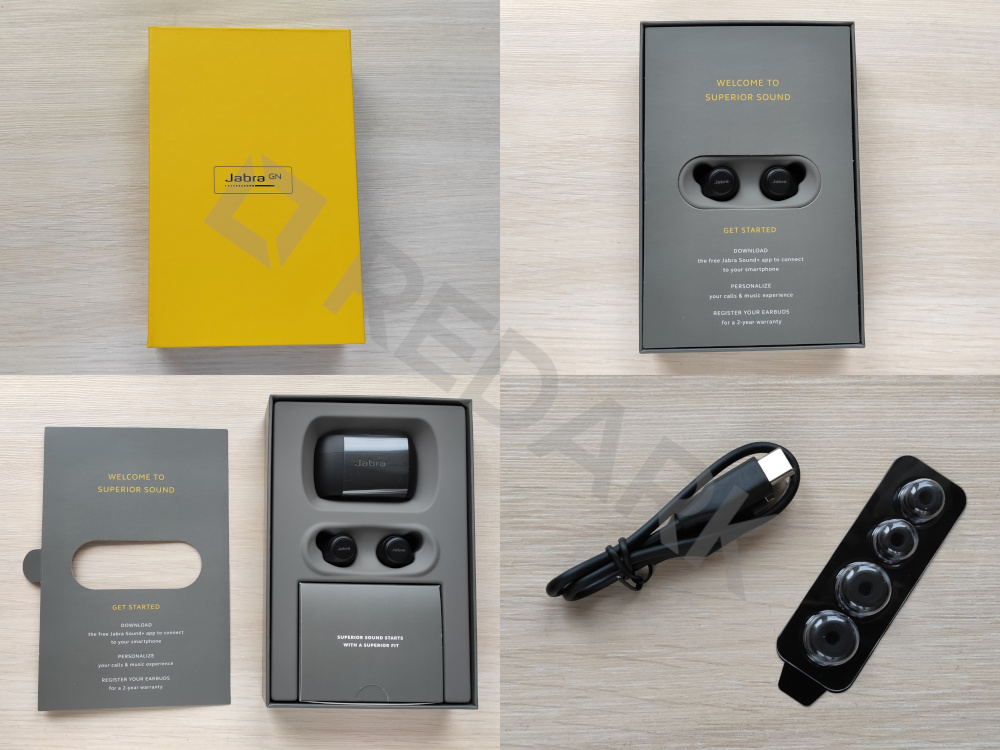
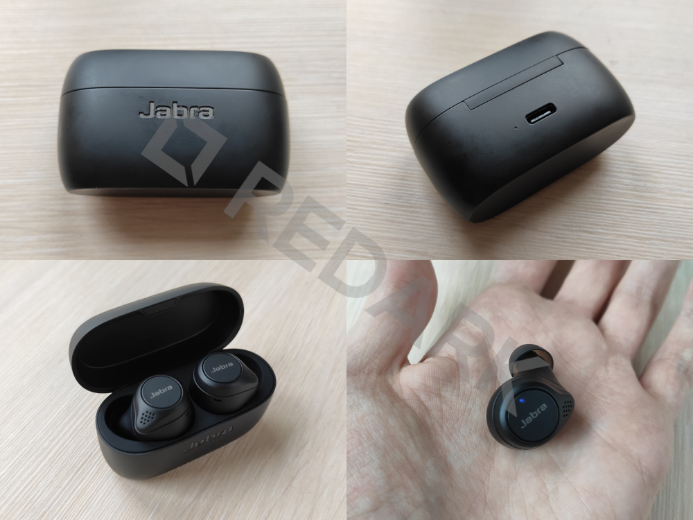
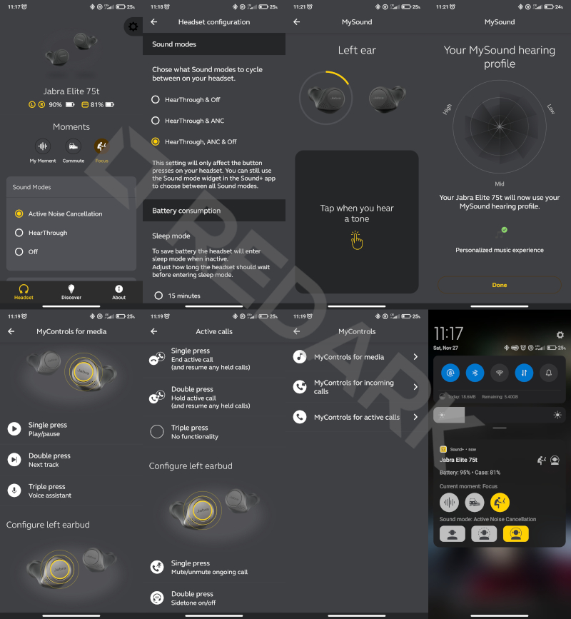

W poprzednim artykule na Redarku zajmowaliśmy się [testowaniem sprzętu od SPC Gear](/spc-sluchawki-viro-pro-mysz-lix). Była to mysz oraz nauszne przewodowe słuchawki. Dziś uwolnimy się od kabli i zerkniemy na słuchawki z rodziny True Wireless (w skrócie TWS), a będą nimi **Jabra Elite 75t**. O pomoc w ich wyborze prosiłem Was jakiś czas temu na Twitterze i chciałbym z tego miejsca podziękować [Jakubowi Kordasińskiemu](https://twitter.com/kordaal), który pomógł mi w podjęciu tej decyzji. Jakub specjalizuje się w recenzowaniu zestawów TWS, lecz dla mnie jest to pierwsze spotkanie z technologią True Wireless i słuchawkami dokanałowymi.

## Unboxing i wygląd

Pudełko jest utrzymane w charakterystycznej dla producenta kolorystyce szarości oraz wściekłej żółci. Po otwarciu zestawu widzimy elegancko wyeksponowane dwie dokanałowe słuchawki oraz etui ładujące. Obok znajduje się również mini pudełko skrywające dołączone do słuchawek drobne akcesoria. Jest to krótki kabel USB-C oraz zestaw silikonowych końcówek o różnych rozmiarach. Otrzymujemy ich trzy komplety, z czego te o średnim rozmiarze, są już zamontowane fabrycznie na słuchawkach.

Etui zostało wykonane z matowego, lekko palcującego się czarnego plastiku o dobrej jakości. Z przodu pod klapką widnieje subtelnie połyskujące logo producenta, a z tyłu pod zawiasem znajdziemy port USB-C oraz diodę LED informującą o stanie naładowania baterii. Ta zapala się po otwarciu lub zamknięciu pokrywy, a także podczas procesu ładowania. Poziom baterii reprezentowany jest za pomocą trzech kolorów - zielonego, pomarańczowego i czerwonego.

<AdSense />

Same słuchawki są średniego rozmiaru i mieszczą się prawie całkowicie w małżowinie usznej człowieka. Front urządzenia zdobi duży okrągły przycisk z logotypem Jabra. Jest on fizyczny, a nie dotykowy tak jak w większości słuchawek TWS. Powyżej napisu Jabra obie słuchawki wyposażone są diodę LED podobną do tej znajdującej się na etui. Informuje ona o stopniu naładowania baterii (zaraz po otwarciu etui) oraz o procesie parowania z telefonem (po wyjęciu z etui). Na obudowie pojedynczej "pchełki" znajdziemy również styki służące do dokowania i ładowania słuchawki w etui, otwór na sensor zbliżeniowy oraz 2 mikrofony - jeden znajduje się z przodu na froncie, a drugi na brzegu z tyłu urządzenia.

## Aplikacja sterująca

Aby wykorzystać pełny potencjał słuchawek Jabra Elite 75t, należy skorzystać z **aplikacji mobilnej "Sound+"** dostępnej w systemach Android oraz iOS. Oprogramowanie to zaskoczyło mnie pozytywnie jakością i ogromem opcji personalizacji. Główny ekran umożliwia podejrzenie stopnia naładowania wszystkich akcesoriów oraz wybranie jednego z trzech trybów działania słuchawek. Tryb "ANC" uruchamia aktywną redukcję szumów, "HearThrough" wykorzystuje wbudowane w słuchawki mikrofony do przekazywania otaczającego nas dźwięku do uszu (omijając tym samym pasywną redukcję hałasu) oraz "Off", który odpowiada za standardowy tryb pracy urządzenia. Poniżej znajduje się również equalizer, kilka gotowych ustawień dźwięków oraz funkcja generująca uspokajający szum tzw. pink noise.

Ogrom przydatnych opcji znajdziemy w ustawieniach aplikacji "Sound+". Umożliwiają one pełną personalizację sterowania oraz brzmienia "elitek". Znajdziemy tam opcje takie jak:

- automatyczne pauzowanie muzyki po wyjęciu słuchawki z ucha,
- wyciszanie lub przyciszenie muzyki po wejściu w tryb "HearThrough",
- odtwarzanie dźwięku przypominającego o wyciszonym mikrofonie podczas rozmowy,
- opcja "Sidetone", która przekazuje nasz głos do uszu podczas rozmów telefonicznych (zapobiega to seplenieniu),
- kolejność trybów pracy wybierana po skorzystaniu z przycisku na słuchawce (3 możliwe kombinacje),
- wybór głosowych lub tonowych komunikatów informacyjnych.

Oprócz tego tryb ANC może zostać dostosowany do naszego gustu, a rozbudowany **kreator "MySound" pozwoli automatycznie dobrać balans dźwięków na podstawie naszego wieku, płci oraz przeprowadzonego testu tonowego**. Aplikacja odtwarza w każdej słuchawce po kolei kilka tonów o różnej częstotliwości i prosi o wskazanie momentu, w którym zaczną być one dla nas słyszalne. Na koniec kreator wyświetla mały diagram prezentujący wyniki badania naszego słuchu oraz wprowadza korekty w brzmieniu słuchawek.

Przyciski znajdujące się na obu słuchawkach mogą mieć przypisanych 6 różnych akcji - po 3 na każdą stronę. Rozróżniane jest pojedyncze, podwójne oraz potrójne kliknięcie przycisku. Skróty różnią się w zależności od tego, czy w danej chwili słuchamy muzyki, czy prowadzimy rozmowę telefoniczną. Podczas słuchania muzyki mamy do wyboru: play/pauza, następny utwór, poprzedni utwór, asystenta głosowego, zmianę trybów pracy słuchawek (ANC/HT/Off). Przy połączeniu telefonicznym jest to: odrzuć lub odbierz połączenie, odbierz i zawieś aktywne połączenie, przełącz na drugą rozmowę, wycisz mikrofon oraz włącz lub wyłącz opcję "Sidetone". Możliwości personalizacji jest zatem wiele, choć zabrakło mi jeszcze opcji sterowania głośnością - po to musimy niestety sięgnąć do telefonu.

<InfoBlock>
Aplikacja "Sound+" oferuje również podręczny widget widoczny na pasku powiadomień telefonu, który umożliwia szybkie podejrzenie stanu baterii oraz zmianę trybu pracy słuchawek.
</InfoBlock>

<AdSense />

## Wrażenia z użytkowania

Słuchawki zakupiłem podczas Black Friday, więc korzystam już z nich prawie miesiąc. Jakość generowanych przez nie dźwięków jest bez zarzutu, tak samo, jak czas pracy na baterii. Zarówno etui, jak i słuchawki ładują się błyskawicznie i ani razu nie udało mi się ich rozładować do zera. Dźwięk rejestrowany przez zestaw czterech mikrofonów wbudowanych w Elite 75t nie powala jakością, jest zniekształcony, ale rozmówcy nie mieli problemów ze zrozumieniem mnie nawet w hałaśliwych warunkach. Wiadomo, że nie ma też co oczekiwać klarownego głosu od mikrofonów znajdujących się tak daleko od ust.

Jeśli chodzi o łączność bezprzewodową, to chyba tylko raz zdarzyło mi się, że telefon nie połączył się od razu z lewą słuchawką - musiałem odłożyć ją na chwilę do etui i wyjąć ponownie. Zasięg Bluetooth bez problemu pokrywał całe moje mieszkanie. Jabry zostały sparowane z moim telefonem, laptopem oraz stacjonarną jednostką z modułem na USB, po czym przetestowałem **funkcję łączenia się słuchawek do dwóch urządzeń jednocześnie**. Urządzenie bez problemu łączyło się z dwoma sprzętami naraz, a źródło audio przełączało się automatycznie w zależności od tego, czy na telefonie posiadałem aktywne połączenie głosowe.

Wadą Elite 75t jest natomiast to, że słychać, iż prawa słuchawka zestawu jest dominująca i to ona zajmuje się przekazywaniem sygnału na lewą stronę. Dźwięk w lewej słuchawce startuje często ułamek sekundy później niż po prawej stronie, choć nie jest zdesynchronizowany. Teorię tą potwierdza różnica w czasach rozładowywania się obu akumulatorów. Dodatkowo **tryb mono, który polega na korzystaniu tylko z jednej słuchawki naraz, działa tylko z prawą słuchawką**! Wyjęcie wyłącznie lewej "pchełki" z etui nie powoduje uruchomienia zestawu. Z tego, co się orientuję, to w innych modelach TWS nie ma to znaczenia i możemy używać obu stron naprzemiennie - Jabra Elite 75t niestety działa tylko w jednej konfiguracji i musimy być tego świadomi. Dodatkowo z informacji, jakie znalazłem w Internecie, wynika, że omawiane słuchawki wspierają jedynie podstawowy kodek audio SBC oferowany przez standard Bluetooth. O nowocześniejszych sposobach transmisji dźwięku (np. aptX od Qualcomma) możemy zatem pomarzyć.

<InfoBlock>
Jabra Elite 75t występuje w kilku wersjach kolorystycznych oraz może posiadać możliwość ładowania indukcyjnego. Podstawowy model może być ładowany tylko za pomocą kabla USB-C.
</InfoBlock>

Przez pierwsze dni korzystania z Elite 75t było mi ciężko przyzwyczaić się do ich noszenia, ponieważ były to moje pierwsze dokanałówki i przeszkadzało mi uczucie zatkanego ucha. Obecnie nie mam już z tym problemu i mogę je nosić przez wiele godzin. Spodobały mi się znajdujące się na nich fizyczne przyciski, ponieważ działają pewnie i umożliwiają skorzystanie z nich poprzez dociśnięcie głowy do obojczyka. Nie muszę dzięki temu odrywać rąk od pracy, a w przypadku dotykowych przycisków ten trick by nie zadziałał. Czujniki zbliżeniowe bardzo szybko (a czasami aż za szybko) wykrywają wyjęcia słuchawki z ucha i zatrzymują odtwarzanie. Pasywne tłumienie hałasu działa bardzo dobrze, a tryb ANC działa, choć jest to bardziej drobny dodatek do izolacji akustycznej wkładek silikonowych. Tak się akurat złożyło, że sąsiad robi obecnie u siebie remont generalny, więc miałem bardzo dobre środowisko do przetestowania tych funkcji 😅.

<AdSense />

## Podsumowanie

Słuchawki Jabra Elite 75t to dobry zestaw TWS, choć daleko mu do idealnego. Urządzenie oferuje dobrą jakość muzyki, przyzwoitą jakość rejestrowania dźwięku oraz długi czas pracy na baterii. Niestety cały obraz psuje tryb mono działający tylko na jedną słuchawkę oraz brak wsparcia dla zaawansowanych kodeków audio, które w tej półce cenowej powinny być standardem. Plus za wodoszczelność, dobre wyprofilowanie i osadzenie w uchu obudowy oraz fizyczne przyciski, które przydadzą się podczas intensywnych treningów lub pracy. Pasywna oraz aktywna redukcja szumów działa przyzwoicie i pozwala odciąć się od otaczającego nas świata. W trakcie swojej premiery słuchawki te zostały wycenione na kwotę około 700-800 złotych i w tej cenie uważam, że jest to zakup nieopłacalny. Z pewnością znajdziemy znacznie lepsze modele ze wsparciem aptX oraz prawdziwego trybu mono. Ja swoje elitki zdobyłem w promocji za mniej niż 300 złotych i taka kwota jest moim zdaniem adekwatna do ich możliwości. Dlatego jeśli macie możliwość zdobycia ich w takiej cenie, to serdecznie polecam.

<GoodList>
- dobrze trzymają się uszu
- porządna aplikacja sterująca z personalizacją przycisków i dźwięku
- dobra jakość dźwięku
- pasywne tłumienie hałasu wspierane przez ANC
- praktyczne fizyczne przyciski na obu słuchawkach
</GoodList>

<BadList>
- tryb mono działa tylko z prawą słuchawką
- opóźnione załączanie dźwięku w lewej słuchawce
- brak wsparcia dla zaawansowanych kodeków audio np. aptX
- brak regulacji głośności za pomocą wbudowanych przycisków
</BadList>
