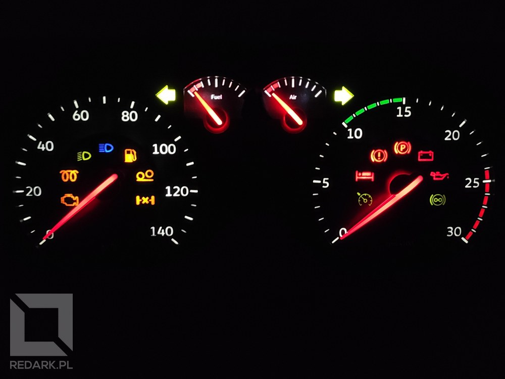
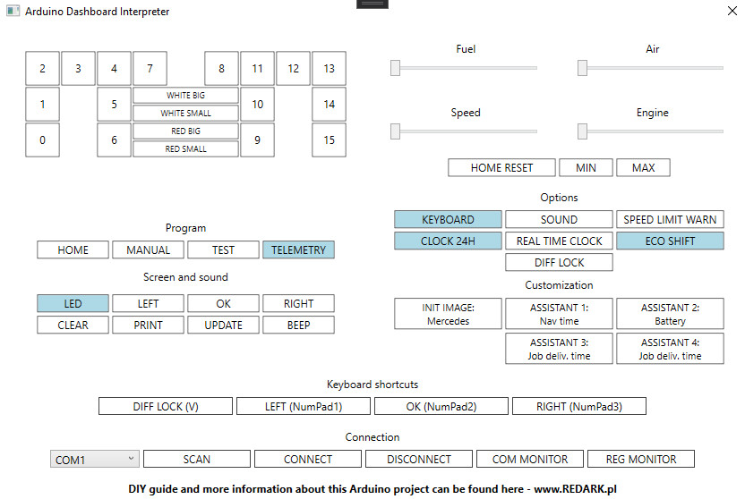
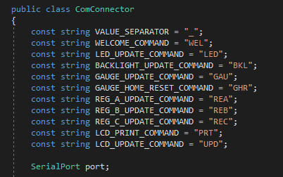
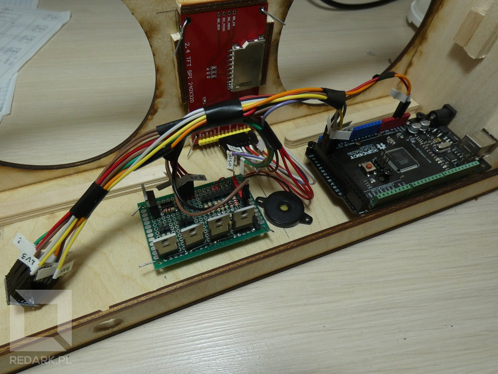

This article was created based on [my original article that had been written in Polish language](/diy-arduino-dashboard-ets-ats). The project became very popular on my website, so I translated it into English, to open it to a wider audience. What is the genesis of the project? As a programmer, I sometimes desire to create something physical, something I can place on the shelf in my room, something that doesn’t exist only on the screen of my computer. I often play Euro Truck Simulator 2 to relax. Once, YouTube started recommending to me some DIY videos with different gadgets for this game. From simple “button boxes” to complete, huge cockpits disassembled from real trucks. I wanted to try my electronic skills and create custom gauges for my game.

The project was made after hours, and it took me about 18 months to complete. Today I have the pleasure to show you the final device and English version of this article. Below this paragraph, you can find a video on YouTube which presents all main features of this project. Maybe the video is not as pretty as I wished it to be, but these are all my skills in DaVinci Resolve application 😅. I hope you will like it:

<YouTube id="KW6sZINNi9Y" title="DIY Arduino Dashboard" />

<InfoBlock>This video includes English subtitles - please enable it in YouTube options.</InfoBlock>

## Project presentation

<Gallery>

</Gallery>

Outside look. The gauge cluster was closed in a rectangular wooden case cut by a laser based on my project. On the left side there is a USB port (type B) which allows connecting the device with a computer. The back of this case contains two elements. First is a knob of the potentiometer which allows you to adjust backlight brightness. The second element is a 12V socket. Supplying it is only required to use red-white backlight of this gauge cluster. Other features (LCD screen, warning lights, gauge motors) can work without this voltage. The front of the case contains four analog gauges: a big speedometer and tachometer, and also small fuel and air pressure gauges. In the middle, between two big gauges, there is a small 2.4-inch LCD screen. The case can be laid flat on the desk or can be placed on a special stand that should make it easier to use them while playing.

<AdSense/>

### Warning lights

Of course, every car gauge cluster should have some colorful warning lights. In other projects, which I saw on YouTube, warning lights had the form of a few 5-mm LED lights stuck in a piece of cardboard. I wasn’t satisfied with this concept, so I decided to take it a step further. My device contains 16 multicolor warning lights - 7 of them are hidden behind the speedometer clock face and the second 7 are hidden behind the tachometer clock face. The last two lights are the turn indicators with the shape of an arrow.

<ImageDescription>All warning lights and gauge backlights</ImageDescription>

Going from left to right:

- **Engine failure** (yellow) - indicates high level of truck damage,
- **Glow plugs** (yellow) - lights up after ignition,
- **Low beam** (green) - indicates activated low beam,
- **High beam** (blue) - indicates activated high beam,
- **Gas pump** (yellow) - indicates low level of fuel,
- **Liftable axle** (yellow) - indicates the truck has a raised one of wheel axes,
- **Differential lock** (yellow) - indicates that the differential mechanism is locked,
- **Cruise control** (green) - lights up after when cruise control is active,
- **Bed** (red) - indicates that the driver need to rest,
- **Brake failure** (red) - flashes when air pressure in brake system is low,
- **Parking brake** (red) - indicates that the parking brake is on,
- **Battery** (red) - lights up after ignition,
- **Oil** (red) - lights up after ignition,
- **Retarder** (green) - indicates that the retarder of the gearbox is active.

### On-board computer

I’m really proud of the implemented on-board computer with the LCD screen. It’s controlled by the user using 3 predefined keys on a PC keyboard or other game controller (for example, I’m using DualShock4 from PS4). The computer has 7 different screens, which show various parameters about truck, trailer condition, GPS destination and information about current job. One of these screens can be customized by the user, even from the settings menu in the gauges. Also, that menu allows you to change “welcome image” (which shows up on the screen after ignition), time format (12/24-hours), time type (real or virtual from the game), sound alerts and more. The computer even includes an acceleration measurement tool! It allows you to measure the time which is required by the truck to reach specified by the user target speed.

The top section of the screen displays current time, cruise control speed value, number of selected gear and optional shift assistant - arrow up/down. The bottom section contains the odometer, current level of retarder (if the gearbox has its own retarder) and current speed limit from the GPS system. The computer can even display short text notifications which inform the user about near road events. Here’s an example screen of the on-board computer:

<ImageDescription>Example screen of the on-board computer</ImageDescription>

### Test road

Before I start explaining things inside this box and principles of operation, I would like to show you a video with compilation of clips from my example road in Euro Truck Simulator 2:

<YouTube id="NMoZSP29ytk" title="DIY Arduino Dashboard Euro Truck Simulator 2" />

<InfoBlock>This video includes English subtitles - please enable it in YouTube options.</InfoBlock>

## How does this work?

### SCS Software game telemetry

Everything begins from the DLL library delivered by creators of ETS/ATS game - SCS Software. This file allows developers to get access to the game data - state of truck, trailer, GPS track, virtual environment and much more. This DLL file must be placed in a specific game directory on your computer. After this operation, the game at start will always show you a warning message which informs about activated developer mode. You must accept this modal, otherwise external tools on your computer won’t get access to the game data.

### Telemetry interpreter

The SCS Software DLL file only delivers raw data, which is not useful for my project. I had to create an additional tool, the application running on the computer, which will process all the game data and generate commands understood by my device. I wrote the app in C# language. Below, you can see the final user interface:

<ImageDescription>Telemetry interpreter was written in C# language</ImageDescription>

The UI of this app contains all buttons that allow you to control all features included in my device. In the top left corner, there is a matrix of buttons. It represents 16 warning lights and a 4-zone gauge backlight. Section “program” allows you to choose one of four predefined modes:

- **Home** - set all systems to initial state,
- **Manual** - allows to take manual control of all components,
- **Test** - plays animation which tests all components of the project,
- **Telemetry** - primary working mode with game telemetry.

<AdSense/>

Section “Screen and Sound” contains all buttons to control on-board computer LCD and warning sounds. The right side of the interface contains four horizontal sliders which allow you to control the position of four gauge motors. “HOME RESET” button lets you reset the initial position of all gauges. “Options” section contains 7 buttons representing all available settings. The option is enabled, if the button is lit up. Here’s the meaning of all options:

- **Keyboard** - enables keyboard shortcuts,
- **Sound** - on/off warning sounds,
- **Speed Limit Warn** - sound alert of exceeding the speed limit,
- **Clock 24h** - switching time between 12 and 24 hour mode,
- **Real Time Clock** - switching between real time (from the PC) and virtual time (from the game)
- **Eco Shift** - on/off shift assistant,
- **Diff Lock** - state of differential lock (We will talk about this option later).

“Customization” section contains 5 options: “Init Image” - welcome logotype that shows on the screen after ignition and the other 4 options, which allows you to customize your “assistant” screen on an on-board computer. You can select a value from a list of 14 different parameters. These options can be also modified directly in the on-board computer settings menu.

At the end, there are two small sections at the bottom of the app UI. “Connection” allows you to select a virtual COM port that represents our Arduino connected to the PC. If the PC has only one active virtual port, the app tries to connect to the Arduino automatically. “Keyboard shortcuts” section allows you to define four shortcut keys - Left, Ok and Right for an on-board computer and a strange shortcut named “Diff Lock”. Why do we need this thing here?

Telemetry of ETS and ATS games is not perfect. I couldn’t read many of the parameters I needed. I was forced to do some programming tricks to solve these problems. One of those problems was detecting the current state of the differential lock in our truck. I really wanted to have this warning light on my device, so I had to cheat a bit here. First, the user has to set the "DIFF LOCK" shortcut on the same key as switching differential lock in game (default is V key). Then the telemetry app listens for that key press and switches the state of option, when the user presses it . However, it’s not a perfect solution for this issue, because the state of the warning light can be desynchronized if the user uses this key outside the game. That’s why I created an option named “Diff Lock”. If this option desynchronizes, the user can fix this issue by pressing this button.

### USB communication

The task of this telemetry app was to receive and analyze telemetry data from our game. For now, the app can generate special commands that are sent via USB cable to the Arduino. The computing power of Arduino chips is very small, so I was forced to move as many logic operations to the PC as I could. Additionally, logic contained in the C# app on the PC is much easier to debug and test. The default IDE for the Arduino is very archaic, and writing more complex code in it is painful. The list of constants representing code commands is below. I decided not to explain all the application code here. A link to the repository with complete source code will be attached at the end of this article.

## DIY process

Before I start to explain this process, I want to say that the concept of this device has been developed for several months. I started from simple gauges with servomechanism, some 5-mm LEDs and segment LCD. After that, I was thinking about using normal, non modified car gauges, but I didn’t want to have a non-matching tachometer RPM scale and warning lights symbols. The next idea was to use car gauges, but take them apart and adjust them to my requirements. I was even thinking about creating something similar to the Scania S dashboard, with rounded OLED displays in the middle of gauges, but that idea was too complicated and way too expensive. Finally, I decided to find a compromise between difficulty and appearance. That was my first DIY project, so I had to reckon with the fact that not everything would go my way.

<InfoBlock>Detailed wiring diagrams will be attached at the end of this article.</InfoBlock>

### Gauge cluster donor

When I knew what I wanted, I started browsing offers of car cluster gauges that could be used as a donor for my project. The internal structure of this cluster was very important to me, because I wanted to subject this cluster to a series of modifications. After a few days I found the perfect candidate - **Volkswagen Golf of 4th generation**. The gauges were nice, and their arrangement was perfect for inserting between them my LCD screen. Also, I found on the Internet thousands of videos about disassembling, repairing and modding these gauge clusters. I was able to analyze the internal construction just from these videos. I calculated all the necessary dimensions just from the video and basically designed everything before making the purchase. Not only that, but I got them for a ridiculous price, (40 PLN, today's 8.75 euro) because they were damaged during disassembly. The front plastic glass was broken, but it didn’t bother me at all.

<Gallery width='2'>

</Gallery>

<ImageDescription>Volkswagen Golf 4th generation gauge cluster</ImageDescription>

From this cluster, I disassembled the original clock face, 4 red gauges, 4 stepper motors and many colorful LEDs that I grouped according to the color of light. Also, I took the plastic reflector, which I modified with a drill and a set of files. First, I had to remove this plastic piece between big gauges, because that was the place for my LCD screen. The second modification was hollowing a hole for backlight cables, because they had to go through the front of the circuit board. Speaking about the circuit board…

<AdSense/>

### Replacement for the circuit board

Since my knowledge of electronics is very basic, I decided to take apart the original circuit board in order to remove all unnecessary electronic parts. I had to replace it with something else. I decided to use modeling cardboard, but it turned out to be the dumbest decision I made for this project. Unfortunately, I realized this too late. Now I know, I should have designed and ordered a custom PCB, or find someone who knows how to do this. Drilling this cardboard and soldering all of these tiny wires on this soft material was horrible. That cost me a lot of broken cables and destroyed SMD LEDs. But as you can see, I finished this project. The plastic reflector lies on cardboard, on which are glued all LEDs for warning lights and backlight for clock faces and gauges. On the back of the cardboard there are four stepper motors. I attached them with small pieces of multi-layer cardboard and a couple of office paper clips. Each cable is led out to the back of cardboard, signed and bundled together. It got crowded there, but trust me, I had everything under control 😄.

<Gallery width='2'>

</Gallery>

Each of the warning LEDs received two soldered wires. The positive wires were completed with a female goldpin connector, and the negative wires were soldered together and completed again with a female connector. Later, these wires would be connected to the “LED controller”. The white backlight of clock faces has been divided into 3 LEDs for each track (15 in total). The red backlight of gauges has been divided into 2 LEDs for each track (6 in total). Soldering this backlight wasn’t easy, but this light effect was worth it.

### LED controller

To easily take out cardboard from the case, I decided to reduce the number of wires that came to other peripherals. Stretching 16 positive wires of warning light to the Arduino would be tiring. To solve this problem, I used an integrated circuit called MCP23017. It’s a 16-channel GPIO expander that connects with Arduino by I2C bus. I placed this IC on the back of the cardboard. This allowed me to reduce almost 20 wires to just 4 - positive, negative, data (SDA) and clock (SCL).

<Gallery width='2'>

</Gallery>

<ImageDescription>Universal PCB with soldered LED controller</ImageDescription>

The Expander was soldered into a two-sided universal PCB. I also soldered male goldpin sockets on PCB and resistors matched to each LED. I had one problem with this circuit. According to the catalog note of MCP23017, the maximum allowable current is 150 mA, so I had to graduate power delivered to each diode, to reduce power consumption:

- 5x red LED for 6 mA (resistors: 470+47, 517 Ohm in total),
- 5x yellow LED for 9 mA (resistors: 220+100, 320 Ohm in total),
- 5x green LED for 12 mA (resistors: 100+47, 147 Ohm in total),
- 1x blue LED for 16 mA (resistors: 47+47, 94 Ohm in total).

Such a selection of resistors allowed me to get acceptable power of LEDs without exceeding recommended power consumption.

<AdSense/>

### Backlight controller

Inside the case there is a second universal PCB which contains parts whose job is to control the backlight of gauges and LCD screen.

<Gallery width='2'>

</Gallery>

<ImageDescription>The first tests of the backlight controller</ImageDescription>

On the left side of the PCB there are two long male goldpin sockets. They are serving as a cable distributor. The black is for negative cables and the red is for 12 volt positive cables. These sockets are connected with the 12 V socket on the back of the wooden case. The top section of the PCB contains four N-MOSFET transistors. The 1st controlling white light of big clock faces, the 2nd controlling white light of small clock faces, the 3rd controlling red big gauges and the last, 4th controlling red small gauges. Outputs of the transistors are connected with properly calculated resistors and goldpin connectors. Also, the PCB has the 5th MOSFET transistor, but this time with type P channel. It controls the backlight of the LCD screen. Beside the transistor, there is a small red goldpin socket which is serving as a 3,3 voltage distributor delivered by Arduino board.

In some photos, you can see a small audio buzzer connected to the backlight controller, but for the final version of this device, I decided to change the physical buzzer with sounds being played from PC speakers/headphones.

### Stepper motors

To precisely rotate gauges, I had to use stepper motors. I disassembled these parts from the Volkswagen gauge cluster. It was equipped with model x27.168. They are mounted behind the cardboard PCB and connected directly to Arduino by 4 wires for each motor - 16 in total. Pinouts of the motor coils were placed in front of the parts, so I had to cut small holes in cardboard to drag them into the Arduino. Behind each stepper motor, I tied up all four wires together to create a comfortable bundle of cables. Additionally, wires of the tachometer stepper motor were extended to easily reach the Arduino board. Motors are assigned by letters A, B, C and D - going from left to right and looking from front of the device. Pinouts of the coils are assigned by numbers. Looking from the side of the gauge axis: on the left side there are 2-1 pinouts and on the right side there are 3-4. You can find a detailed explanation of the motor connections on the wiring diagram at the end of this article.

### LCD screen

The element critical to the success of this project was the LCD screen displaying the interactive on-board truck computer. The screen has a diagonal of 2.4-inches and resolution of 240x320 pixels. Connecting this element to the Arduino wasn’t easy. ILI9341 controller responsible for the screen control works with 3.3 volt logic, while Arduino with 5 volt, so I had to use a small 4-channel logic level converter which was connected between Arduino and LCD. Below, you can see the bundle of screen cables. Everything was designed in such a way, each cable goes there, where it should be connected. The bundle is connected with the Arduino, LCD, logic level converter, 5V/3.3V power rails and P-MOSFET which controls the backlight of the screen. The LCD is using SPI interface, so it has 5 wires - SCK, DC, CS, MOSI and MISO (the last wire does not require a logic level converter).

<ImageDescription>Huge cable bundle of the LCD screen</ImageDescription>

I couldn’t use the same type of fastening as I had done with stepper motors or universal PCBs. The office paper clips couldn’t be passed through the wood, because I didn’t want to ruin the appearance of the front of the device. The clips have been bent in a U shape, so that it is held in place only by the bar holding the edges of the screen PCB. I was worried about the efficiency of these holders, but that was a great idea. The screen stays securely in its place and additionally, the LCD is independent of the main cardboard.

<Gallery>

</Gallery>

Controlling the LCD was very hard due to the low computing power of the Arduino. I had to write a very optimal drawing code. The screen has been divided to three parts, which each has an individual refresh rate to reduce the surface that must be cleared before refreshing. The screen is not working perfectly, and you can easily see the moment when the Arduino CPU freezes, and it doesn’t move the gauges for a moment, but I did everything I could to minimize this effect.

### Wooden case

And now, a few words about the wooden case. It was cut by the laser based on my design. The material is plywood with 3 millimeters of thickness. Every dimension of the case was calculated based on measurement of the original Volkswagen cluster. I copied the shape of the front holes with paper and pencil, then I scanned this to the computer and processed with Gimp and CAD applications. When the project was good enough, I ordered a plywood cut online.

<Gallery width='2'>

</Gallery>

<ImageDescription>Design and assembling process of the wooden case</ImageDescription>

I regret ordering this thin 3 millimeter plywood, because in one place it was deformed by moisture. I should have used 5 or 6 millimeters thickness material, but it didn't matter, because the final effect was great. After I received a package with a case I had to make holes for Arduino mounting points, USB-B port, 12 V socket and backlight’s potentiometer. At the end, I glued inside the case two L shaped pieces of plywood and two wooden sticks that are going to hold the main cardboard with plastic reflector pressed to the front of the case. The strut bar and L shape holders were made from leftovers of the plywood.

<Gallery>

</Gallery>

<ImageDescription>The main cardboard holders</ImageDescription>

<AdSense/>

### Gauge clock faces

An element as important as the wooden case is the clock face of the gauges. From the beginning, I wanted to create gauges adapted to the truck engine and ETS/ATS game mechanisms. I needed two things - the original clock faces of the cluster and an application that allows me to design new scales for the gauges. The first was easy. I had the original clock faces, so I scanned them, additionally illuminating them with a flashlight. That was required to make half-transparent warning light symbols more visible. With the second thing, I had a problem. I didn’t find any good-looking app that allows me to create new clock faces. What did I do? I created a new one! [The app is called “Gauge Generator”](https://github.com/adan2013/Gauge-Generator) and it is available on my GitHub account. It allows you to create from scratch new clock faces and export them to PNG files.

<Gallery>

</Gallery>

<ImageDescription>The Gimp and my unique Gauge Generator app</ImageDescription>

The second step was of course to print these new faces. I had to combine a few layers of different materials to receive good results of light transmittance. I started testing multiple combinations of paper, transparent foil and tracking paper. The first versions of clock faces were printed with negative colors to reduce toner consumption. When the location of all elements seemed good, I started printing the black versions. Below, you can see the first black and glued version of gauge faces. As you can see, the warning lights looked bad, white elements were visible and layers of the right tachometer gauge shifted during the gluing process. I have been analyzing every mistake, and I fixed them in the next versions.

<Gallery>

</Gallery>

<ImageDescription>The first black version of my custom clock faces</ImageDescription>

The final form has four layers of materials. Three layers of transparent foil with printed white (actually transparent) warning lights, and the top layer of tracking paper without warning lights. This combination of layers allows me to receive a good contrast of warning light, similar to the original clock faces. Also, I added to the project a few crosses that made the gluing process easier. I glued the layers on the glass table illuminated by a powerful flashlight. I have used spray glue, but it left small droplets on the surface of the foil. After every gluing, I had to cover layers with a clear sheet of paper, and squeeze out the air trapped between layers using a plastic card. At the end, I covered the whole thing with a pile of books for one night.

<Gallery>

</Gallery>

<ImageDescription>Gluing process on the illuminated glass table</ImageDescription>

Creating these clock faces was a huge challenge, but I think the final look was worth it. It looks beautiful, and they are a hundred times better than the car version with the wrong scale of values. Even half a day of taking apart my laser printer (which broke down during printing) was worth it 😂.

## Summary of the project

### Cost estimation

For DIY projects, many users want to know what the final cost of the whole project was. I estimate the approximation of every part that I used in this device. I excluded from this list all tools (for example soldering iron), which I bought to create this thing. Also, I didn’t list the price of elements, which I used only partially. Most of these parts I bought on a Polish online shop called [Botland](https://botland.com.pl/).

<ImageDescription>Project cost estimation</ImageDescription>

As you can see, the final cost of the project is between 300 and 350 PLN. For me, it is a good price for such an advanced project. Other projects, which I found on the Internet, didn't look as good as this one.

<AdSense/>

### Wiring diagrams

As I promised, below you call see the complete wiring diagram of my project. If something isn’t clear, you can ask me a question in the comment section below this article.

<ImageDescription>Complete wiring diagram of the DIY Arduino Dashboard project</ImageDescription>

### My opinion

First, I’m glad that I was able to complete this project. That was my first project of this type, and I didn’t know anything about electronics when I started. Second, I’m proud of the screen with an on-board computer and generally of the appearance of the device. Third, I should have used a custom PCB for wiring warning lights and gauge motors. Soldering these cables on cardboard was a nightmare and made the project execution much more difficult.

### GitHub repository

Now, It is time to open source. The complete code of the telemetry interpreter, Arduino code, files with graphics, gauge clock faces - everything, what I created for this project, I placed in a public GitHub repository.

<ActionButton to='https://github.com/adan2013/DIY-Arduino-Dashboard'>Go to GitHub</ActionButton>

### Feature projects

And that's all for today. I’m sure it’s not the end of my adventure with electronics. I have many other ideas for new devices. Also, you can find [an article about my second DIY project](/diy-raspberry-book-reader) on this website (only in Polish). I hope you liked this article and the device 🙂.
