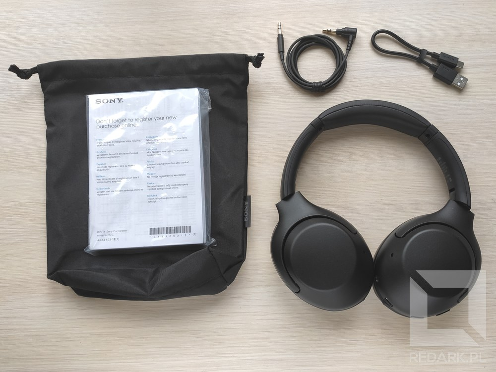

Niestety [recenzowane tutaj jakiś czas temu słuchawki Edifier](/recenzja-test-sluchawek-edifier-w820bt) postanowiły dokonać żywota, a ponieważ nie mogły być już wymienione na nowy egzemplarz, trzeba było poszukać dla nich zastępstwa. Wybór padł na firmę Sony oraz model WH-XB900N, który zainteresował mnie kilkoma ciekawymi funkcjami. Zapraszam do recenzji.

## Unboxing

Pod białym zewnętrznym opakowaniem znajduje się eleganckie czarne pudełko, które po otwarciu, od razu prezentuje naszym oczom zakupione słuchawki. Pod wytłoczką znajdują się dołączone do zestawu akcesoria - instrukcje obsługi, etui w postaci worka, a także dwa kable. Pierwszy to krótki kabel USB-C do ładowania słuchawek, a drugi to standardowy jack audio 3.5 mm zakończony z jednej strony wtykiem kątowym. Jest on sygnowany logo Sony oraz posiada drobną chropowatą fakturę.

<Gallery>

</Gallery>

Pierwsze wrażenie po wzięciu słuchawek WH-XB900N do ręki jest bardzo pozytywne. Urządzenie zostało wykonane z dobrej jakości plastików, które nie wydają żadnych niepokojących trzasków nawet podczas mocnego rozciągania i wyginania. Same muszle można złożyć do wewnątrz konstrukcji, a także obrócić w jedną stronę o 90 stopni, aby ułożyły się na płasko. Zawiasy chodzą pewnie i dobrze blokują się w pozycji użytkowej. Wykonanie poduszek nie odstaje od reszty zestawu. Są bardzo miękkie i dobrze dopasowują się do kształtu głowy. Spodobał mi się również ich rozmiar. Bez problemu zmieściłem w nich całkowicie swoje uszy, a pomimo to, całe słuchawki nie są przesadnie duże i dobrze prezentują się na głowie. Pałąk posiada regulację wysokości oraz drobną poduszkę na szczycie, która dobrze wpływa na komfort użytkowania.

## Obsługa urządzenia

Na lewej muszli znajdują się dwa gniazda - USB-C do ładowania oraz jack 3.5 mm dla alternatywnego trybu przewodowego. Na krawędzi znajduje się dioda statusu oraz dwa fizyczne przyciski. Jeden służy do włączania/wyłączania urządzania oraz do sprawdzania procentu naładowania baterii. Drugi, podpisany jako CUSTOM, pozwala na przełączanie trybów pracy słuchawek lub uruchamianie asystenta głosowego. Lewa słuchawka jest też wyposażona w moduł komunikacji NFC, który umożliwia szybkie parowanie telefonu ze słuchawkami.

Prawa muszla nie posiada za to żadnych widocznych elementów. Cała jej frontowa powierzchnia to duży panel dotykowy, który interpretuje rysowane przez nas gesty. Przeciągnięcia w pionie regulują głośność, a w poziomie zmieniają utwory. Dwukrotne puknięcie na środku muszli wstrzymuje lub wznawia odtwarzanie, a także odbiera połączenie głosowe, gdy takowe są aktywne. Przytrzymanie palca na środku uruchamia asystenta głosowego.

<Gallery>

</Gallery>

## Tryby pracy słuchawek

Przycisk CUSTOM służy do przełączania się pomiędzy trzema trybami pracy urządzenia. Domyślnie uruchamiany jest zawsze tryb aktywnej redukcji szumów ANC. Następny tryb to ambient, który wykorzystuje mikrofony do przekazywania odgłosów otoczenia do naszych uszu. Trzeci, ostatni tryb, umożliwia korzystanie ze słuchawek bez żadnych "ulepszaczy". Mam dwie uwagi, co do działania przełączania tych trybów. Po pierwsze urządzenie nie zapisuje ostatnio wybranego przez nas trybu i zawsze uruchamia się w trybie ANC, co pewnie będzie czasami niepotrzebnie drenowało baterię. Po drugie, przy każdej zmianie trybu, słuchawki odtwarzają komunikaty dźwiękowe. Podczas testów były one bardzo denerwujące, ponieważ lektor zamiast skrótów wypowiada niepotrzebnie pełne nazwy, które na długo przerywają odtwarzanie muzyki. Zamiast prostych "ANC", "Ambient" oraz "Off", słyszymy "Noise cancelling", "Ambient sound", a także moje ulubione "Ambient sound control off" - brakuje jeszcze tylko zwrotu grzecznościowego...

Bardzo spodobała mi się za to funkcja szybkiego włączania trybu ambient. Gdy tylko potrzebujemy skupić się na odgłosach otoczenia, nie musimy przerywać odtwarzania muzyki, ani korzystać z przycisku CUSTOM. Gdy tylko przyłożymy płasko dłoń do panelu dotykowego znajdującego się w prawej muszli, słuchawki natychmiastowo przejdą w tryb ambient (przekazywanie dźwięku z mikrofonów), a także przyciszą odtwarzaną muzykę. Gdy tylko puścimy słuchawkę, odtwarzanie wróci do normy. Wykrywanie tego gestu działa bezbłędnie i jest nieocenione, gdy chcemy odpowiedzieć komuś z domowników bez przerywania muzyki lub ściągania słuchawek. Bardzo ciekawy pomysł ze strony Sony.

## Jakość dźwięku

Słuchawki zachwyciły mnie jakością dźwięku. Niskie tony są wyraziste i nie są przesadzone. Tryb ANC nie sili się na mocne wycinanie dźwięków otoczenia i z niektórymi szumami otoczenia kompletnie sobie nie radzi, a jedynie zmienia trochę ich dźwięk, ale nie odczułem zmian w brzmieniu muzyki podczas korzystania z niego. Przekazywanie dźwięków otoczenia w trybie Ambient działa za to bardzo dobrze. Zastosowane w słuchawkach mikrofony stereo są naprawdę dobrej jakości.

## Asystent głosowy

Sony WH-XB900N obsługują dwóch asystentów głosowych - Google Assistant lub Amazon Alexa. Zaraz po sparowaniu słuchawek z moim telefonem, Google zaoferował mi aktywację asystenta, co też uczyniłem, jedmak do jego działania mam parę uwag. Po pierwsze nie wiem dlaczego, ale wszystkie komunikaty pochodzące od GA były bardzo ciche - kompletnie nie zwracały one uwagi na ustawioną przeze mnie głośność. Nie wiem, czy jest to wina samych słuchawek, czy mojego telefonu lub asystenta, ale warto to zaznaczyć. Po drugie pogratulować osobie, która tworzyła instrukcje obsługi, ponieważ wprowadza ona użytkownika w błąd. Domyślnie asystent przypisuje się do przycisku CUSTOM, a nie, jak wg instrukcji, do przytrzymania panelu dotykowego. Dodatkowo powoduje to, że od chwili aktywowania asystenta, nie możemy już zmieniać ręcznie trybów pracy słuchawek. Dopiero po zainstalowaniu opcjonalnej aplikacji na telefon jesteśmy w stanie przywrócić przełącznik trybów i przenieść asystenta na panel dotykowy. Bardzo dziwne posunięcie.

## Aplikacja sterująca

W poprzednim akapicie wspomniałem o opcjonalnej aplikacji Sony na telefony, która pozwala zmodyfikować zachowanie słuchawek. Dostępna jest ona na systemy Android oraz iOS, a z najważniejszych funkcji mogę wymienić możliwość zmiany języku komunikatów dźwiękowych, personalizację przycisku CUSTOM, equalizer dźwięku wraz z efektami specjalnymi oraz możliwość automatycznego zmieniania trybu pracy słuchawek. Aplikacja stara się analizować nasz ruch oraz lokalizacje (jazda autobusem, siłownia, dom, spacer itp.) i dobierać do tego optymalny tryb. Ciekawą opcją jest też 360 Reality Audio wspierane przez niektóre aplikacje muzyczne np. Tidal. Funkcja ta umożliwia sfotografowanie swojej małżowiny usznej oraz automatyczną analizę i dobranie optymalnych ustawień dźwięku przy użyciu sztucznej inteligencji.

## Łączność i zasilanie

Sony oddało nam do dyspozycji zarówno łączność bezprzewodową Bluetooth, jak i przewodową, z której możemy skorzystać w przypadku jednostek stacjonarnych lub po rozładowania baterii. WH-XB900N wspierają również komunikację NFC. Jeśli posiadasz telefon z modułem NFC, możesz szybko sparować go ze słuchawkami poprzez przyłożenie go do lewej muszli słuchawek. Testowałem ten sposób i wszystko działało bezbłędnie. Zastanawiałem się, jak często parujemy słuchawki, że potrzebujemy NFC do przyspieszenia tego procesu, ale wtedy zauważyłem, że WH-XB900N nie pozwalają na jednoczesne połączenie z dwoma urządzeniami. Gdy słuchawki były połączone z telefonem, to próba połączenia z laptopa kończyła się błędem i na odwrót. Trochę szkoda, czasami trzeba będzie pewnie ręcznie zrywać połączenie w ustawieniach Bluetooth, aby móc skorzystać z drugiego urządzenia.

Łączności bezprzewodowej nigdy nie udało mi się zerwać podczas normalnego korzystania i chodzenia po całym domu. Bardzo dobrze spisuje się też para wbudowanych mikrofonów. Podczas rozmów głos jest klarowny i dobrze zrozumiały. Skróty panelu dotykowego działały poprawnie na wszystkich moich urządzeniach, choć mały minus, że słuchawki umożliwiają jedynie odebranie rozmowy, a rozłączenie dostępne jest dopiero po odebraniu połączenia. Jeśli chodzi o zasilanie, to bateria urządzenia starcza do 30 godzin słuchania muzyki, a ładowanie do pełna zajmować ma wg producenta aż do 7 godzin, choć u mnie z 20% udało się uzupełnić baterie w nieco ponad 4 godziny. Na szczęście w razie czego mamy tryb przewodowy, więc nie jest źle.

## Podsumowanie

Słuchawki Sony WH-XB900N to wzorowe wykonanie połączone z bardzo dobrą jakością dźwięku. Ich rozmiar to idealny kompromis między wygodą a mobilnością, a zastosowanie panelu dotykowego pozwoliło zaimplementować wiele skrótów do wbudowanych funkcji bez wyposażania słuchawek w wiele fizycznych przycisków. Duży plus za dobrą jakość mikrofonów oraz możliwość szybkiego uruchomienia trybu ambient poprzez przyłożenie do ucha dłoni. Ciężko było mi się doszukać w nich wad. Chyba największym problemem jest dla mnie brak zapisywania ostatnio wybranego trybu oraz przydługie komunikaty głosowe, choć nie jest to nic, co znacząco utrudniało by korzystanie z nich. Są to w dodatku problemy, które Sony może łatwo poprawić poprzez aktualizację oprogramowania w przyszłych modelach, na co mam nadzieję. Tymczasem wracam do słuchania muzyki i zapraszam na kolejne artykuły na Redarku.

Plusy:
<GoodList>
- wzorowe wykonanie
- optymalny rozmiar oraz kompaktowa, składana konstrukcja
- intuicyjne sterowanie
- bardzo dobra jakość dźwięku z szeroką regulacją bassów
- nieinwazyjny tryb ANC oraz szybki tryb ambient po przyłożeniu ręki do prawej muszli
- alternatywny tryb przewodowy oraz moduł NFC
</GoodList>

Minusy:
<BadList>
- niepotrzebnie długie komunikaty głosowe
- problemy z głośnością komunikatów od Google Assistant
- brak łączności z dwoma urządzeniami jednocześnie
</BadList>
