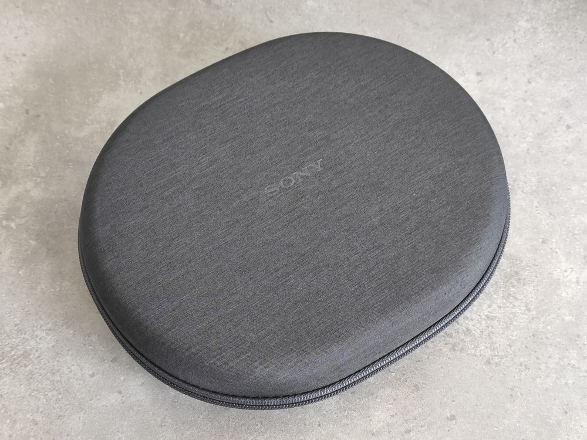
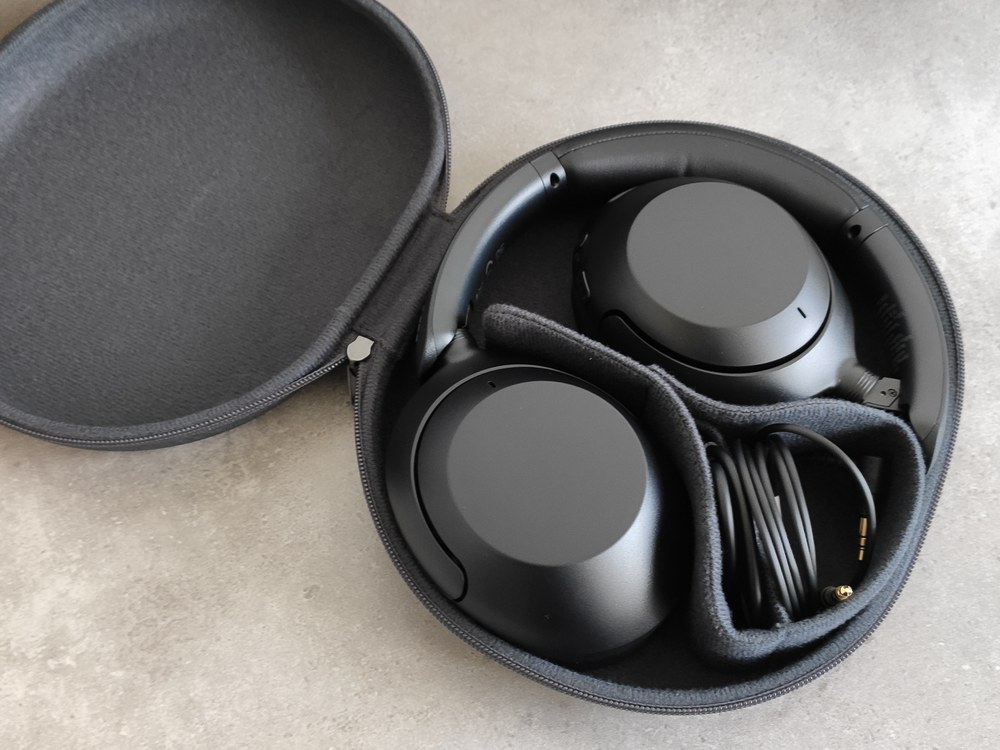
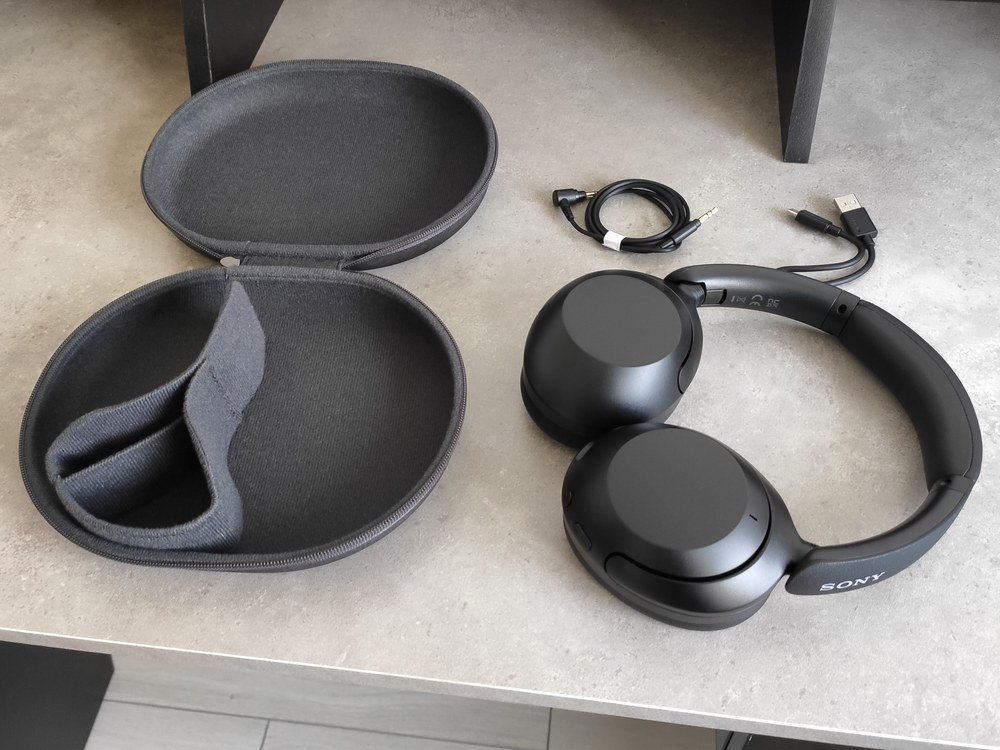
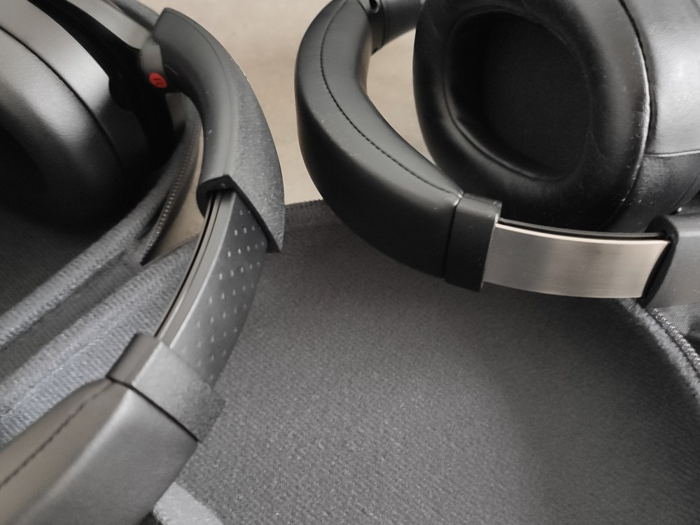
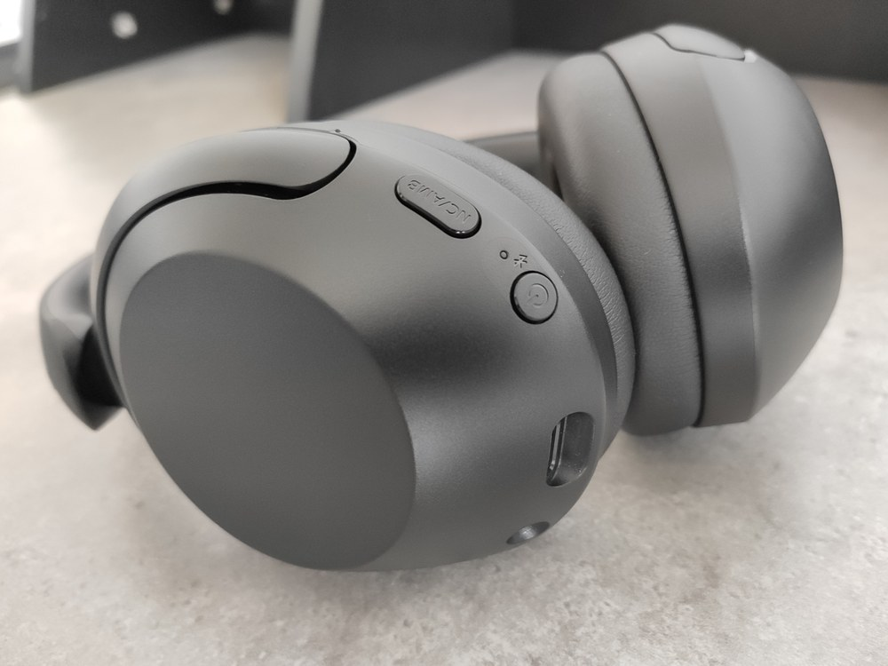
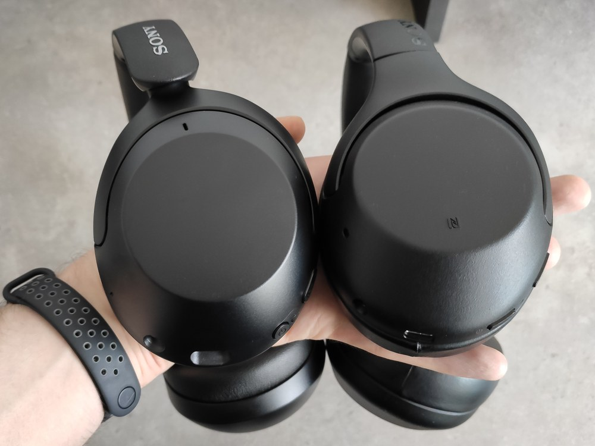
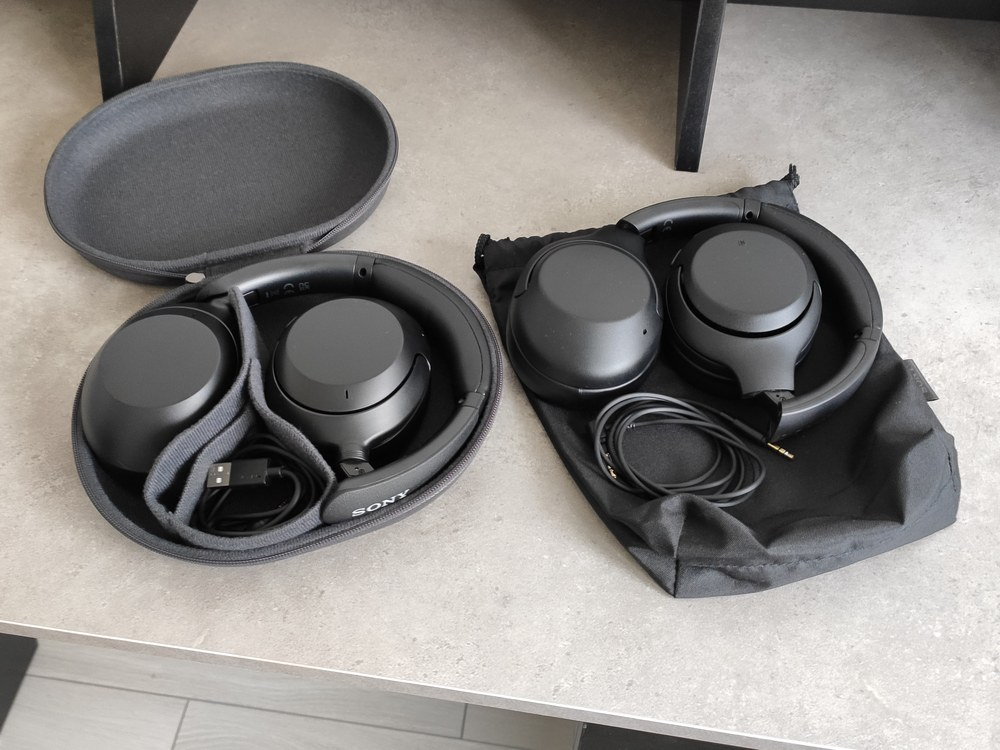
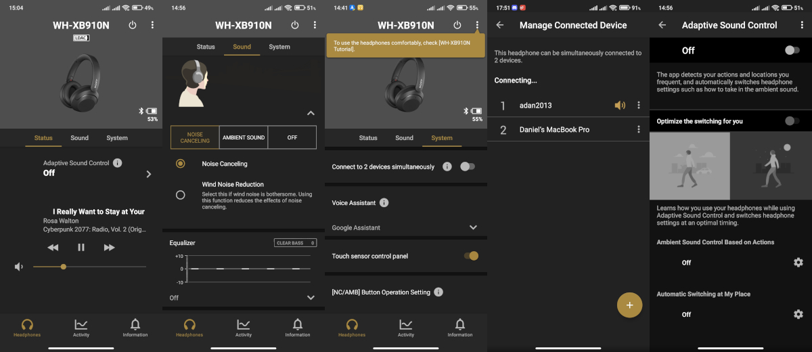
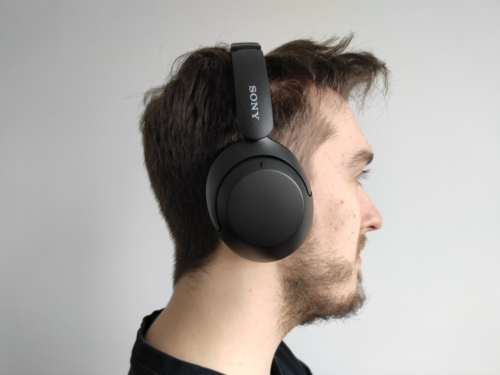

Pół roku temu, na portalu Redark, recenzowałem dla Was [słuchawki bezprzewodowe Sony WH-XB900N](/recenzja-sluchawek-sony-wh-xb900n). Na szczęście, w przeciwieństwie do swoich poprzedników - [Edifier’ów](/recenzja-test-sluchawek-edifier-w820bt) - te nadal działają i mają się dobrze, tylko że nie ja korzystam z nich na co dzień. Jednak przez zmianę pracy oraz stanowiska komputerowego też zostałem zmuszony przejścia na bezprzewodowość. Testowane wtedy WH-XB900N są już wycofywane ze sprzedaży na rzecz modelu nowej generacji, czyli WH-XB910N i takowe zakupiłem do swojego użytku. Z racji tego, że jest to bezpośrednia kontynuacja przetestowanych wcześniej słuchawek, będę często porównywał obie generacje.

## Unboxing

Sposób pakowania jest bardzo podobny do poprzednika. Pod wierzchnim białym opakowaniem znajdujemy właściwe szare pudełko sygnowane logotypem Sony. Jego wnętrze skrywa duże materiałowe etui oraz zestaw ulotek - instrukcji, gwarancji oraz kodów zniżkowych do różnych aplikacji muzycznych.

<Gallery>

</Gallery>
<ImageDescription>Solidne praktyczne etui - duży plus dla Sony</ImageDescription>

Ogromny plus dla Sony to nowe etui. W poprzedniej generacji do zestawu dorzucono jedynie prosty worek ze ściągaczem. Tutaj otrzymujemy solidne, twarde i eleganckie etui, które jest w stanie uchronić słuchawki przed wieloma uszkodzeniami podczas transportu. Wewnątrz, oprócz słuchawek, znajdziemy też przegródki wraz z dwoma dołączonymi do zestawu kablami. Pierwszy to miniaturowy [kabel USB-C](/kablologia-zlacza-usb), a drugi to kabel audio jack 3.5 mm o długości około 120 centymetrów, który pozwala używać słuchawek w tradycyjnej przewodowej formie.

Budowa słuchawek względem modelu WH-XB900N przeszła kilka modyfikacji, ale to nadal ta sama sprawdzona konstrukcja. Plastik jest dobrej jakości i nie wydaje nieprzyjemnych trzasków podczas rozciągania. Zawiasy chodzą pewnie, blokują się w pozycji użytkowej oraz posiadają zadowalający zakres regulacji. Poduszki wykonane ze standardowej sztucznej skóry dobrze trzymają się głowy oraz izolują od dźwięków otoczenia. Jedyny minus, jaki zauważyłem względem poprzedniej generacji, to wykonanie pałąku. W modelu WH-XB900N był on wzmocniony metalem, który był widoczny z zewnątrz, natomiast w WH-XB910N wszystko wskazuje na to, że pałąk jest w całości wykonany z plastiku. Być może metal znajduje się wewnątrz, ale nie jestem w stanie go wyczuć poprzez wyginanie słuchawek. Pałąk jest miękki i mam nadzieję, że Sony nie przyoszczędziło za bardzo na jego wykonaniu.

<Gallery>

</Gallery>

## Obsługa urządzenia

Ponownie wszystkie widoczne elementy sterowania słuchawkami są umieszczone na lewej muszli. Znajdziemy tutaj port USB-C do ładowania baterii oraz gniazdo audio jack do trybu przewodowego. Oprócz tego użytkownik otrzymuje do dyspozycji dwa fizyczne przyciski oraz kolorową diodę statusu. WH-XB910N posiada znacznie większe przyciski od poprzednika. Moim zdaniem jest to zmiana na plus. Są one jeszcze lepiej wyczuwalne pod palcami, a mocniej odróżniający się kształt pomaga w ich prawidłowej identyfikacji. Okrągły przycisk służy do włączania i wyłączania urządzenia, a także do sprawdzania poziomu naładowania baterii. Drugi, duży przycisk, służy do przełączania trybów pracy słuchawek. Domyślnie pozwala on przełączać się tylko między trybami ANC oraz Ambient, ale da się to zmienić w ustawieniach - więcej w dalszej części artykułu.

W przeciwieństwie do poprzednika model WH-XB910N nie posiada na muszli symbolu komunikacji zbliżeniowej NFC. Sony postanowiło z niego zrezygnować i chyba było to dobre posunięcie, ponieważ nie był on bardzo przydatny w poprzednim modelu. Co prawda, faktycznie ułatwiał on parowanie, ale i tak był bezużyteczny, jeśli chodzi o przełączanie między telefonem a laptopem, czyli chyba najpopularniejszej parze urządzeń, z którymi łączymy słuchawki bezprzewodowe, więc nie ma za czym płakać.

Prawa muszla, oprócz standardowego otworu na mikrofon aktywnej redukcji szumów, nie posiada widocznych elementów, ale tak samo, jak u poprzednika, skrywa ona panel dotykowy. Podwójne stuknięcie odpowiada za play/pauzę oraz odbieranie połączeń, przeciągnięcia pionowe regulują głośność, a poziome zmieniają utwory. Przytrzymanie palca na środku pozwala aktywować asystenta głosowego. Tutaj nie mam zastrzeżeń. Sterowania działa, jest bardzo intuicyjne, choć wymaga odrobiny czasu i przyzwyczajenia do “miziania obudowy”.

<ImageDescription>Połączenie fizycznych przycisków i panelu dotykowego to wzór do naśladowania</ImageDescription>

## ANC, Ambient oraz Standard

Sony WH-XB910N posiadają trzy główne tryby pracy, które mogą być zmieniane za pomocą przycisku na lewej muszli lub za pomocą aplikacji na telefon. [Tryb ANC, to oczywiście aktywna redukcja szumów otoczenia](/sluchawki), a tryb Ambient przekazuje dźwięki otoczenia do naszych uszu przy pomocy wbudowanych mikrofonów. Trzeci tryb to standardowa praca słuchawek bez żadnych “ulepszaczy”. [W poprzedniej recenzji](/recenzja-sluchawek-sony-wh-xb900n) miałem dwie duże uwagi co do działania tych trybów. Po pierwsze słuchawki nie zapamiętywały swojego poprzedniego trybu i zawsze uruchamiały się w trybie ANC, co niepotrzebnie drenowało baterię. Po drugie, słuchawki odtwarzały długie i męczące komunikaty głosowe takie jak “Ambient sound control off”. Tutaj brawa dla Sony, ponieważ uwaga… obie te wady zostały usunięte! Słuchawki zapamiętują swój stan po wyłączeniu, a komunikaty głosowe są krótkie i zwięzłe. 👏

Ponownie słuchawki oferują funkcję szybkiego uruchomienia trybu Ambient. Przyłożenie płaskiej dłoni do panelu dotykowego prawej muszli pozwala szybko uruchomić na chwilę tryb Ambient, który przyciszy muzykę i podgłośni dźwięki otoczenia. Bardzo przydatna funkcja, gdy ktoś chce coś do nas powiedzieć, a my nie chcemy na chwilę zatrzymywać muzyki lub ściągać słuchawek.

<InfoBlock>
Domyślnie przycisk trybów na słuchawkach pozwala przełączać się tylko między trybem ANC oraz Ambient. Zachowanie to można zmienić poprzez dedykowaną aplikację na telefony oraz przywrócić brakujący standardowy tryb “Off”. Ja ostatecznie pozostawiłem tryb ANC oraz Off, a tryb Ambient uruchamiałem jedynie panelem dotykowym.
</InfoBlock>

## Jakość dźwięku i działanie ANC

Z brzmienia słuchawek jestem zadowolony tak jak u poprzedniczek. Kompletnie nie czułem potrzeby dotykania equalizera. W trakcie testów korzystałem z kodeka LDAC, ale przełączałem się też na standardowy SBC. Jeśli chodzi o tryb ANC, to mam pewną uwagę. Działa on dobrze i nie zniekształca muzyki, ale gdy nie odtwarzamy muzyki, słychać wyraźny i dosyć głośny szum. Jest on na pewno spowodowany działaniem ANC, ponieważ występuje on jedynie w tym trybie. Co gorsza, nie znalazłem w aplikacji żadnej możliwości dostrojenia redukcji szumu pod swój słuch. Takową opcję miały, chociażby słuchawki dokanałowe [Jabra Elite 75t](/jabra-elite-75t-tws-recenzja) i pomogła ona całkowicie wyeliminować szumienie w trybie bezczynności. Niemniej, po włączeniu muzyki szum nie jest słyszalny i nie zakłóca odbioru treści.

<Gallery>

</Gallery>
<ImageDescription>Porównanie modelu XB910N do poprzedniej genracji XB900N</ImageDescription>

<WarningBlock>
Jakość wbudowanego mikrofonu jest dobra i pozwala na komfortowe rozmowy, ale słuchawki zdecydowanie nie nadają się do np. rozmawiania z innymi graczami podczas grania w gry komputerowe. Po aktywowaniu mikrofonu, słuchawki mocno “przycinają” audio do jakości standardowej rozmowy telefonicznej. Podczas zwykłych rozmów nie robi to problemu, ale zdecydowanie nie można wtedy słuchać na nich muzyki lub dźwięków z gry.
</WarningBlock>

## Personalizacja ustawień

Do odblokowania wszystkich możliwości modelu WH-XB910N należy skorzystać z dedykowanej aplikacji Sony dostępnej na telefony z systemem Android oraz iOS. Oprogramowanie umożliwia drobne spersonalizowanie działania słuchawek oraz brzmienia dźwięku. Wprowadzone ustawienia zapisywane są w słuchawkach oraz w aplikacji, która umożliwia również skorzystanie z kopii bezpieczeństwa w chmurze. Do jednych z ciekawszych opcji można zaliczyć skanowanie małżowin usznych przy pomocy AI (profile wspierane tylko przez niektóre aplikacje takie jak np. Tidal) oraz możliwość dynamicznego zmieniania profili słuchawek w zależności od naszej lokalizacji lub aktywności fizycznej.

W ustawieniach słuchawek można aktywować jedną dosyć ważną funkcję, której nie posiadały poprzednie WH-XB900N. Mowa o możliwości podłączenia dwóch urządzeń jednocześnie i dynamiczne przełączanie się między nimi w zależności, które urządzenie transmituje aktualnie dźwięk. Przydatna opcja, gdy używamy słuchawek zarówno do komputera, jak i telefonu. Dzięki temu możemy odebrać telefon zdalnie bez odsłaniania uszu. Niestety pojawia się tu jedno ograniczenie, o którym informuje nas jasno aplikacja Sony. Jeśli aktywujemy możliwość korzystania z dwóch urządzeń jednocześnie, to automatycznie jesteśmy skazani na korzystanie tylko z podstawowego kodeka SBC. Lepsze sposoby łączności, takie jak LDAC lub AAC, nie będą dostępne, dopóki nie wyłączymy przełączania między urządzeniami w ustawieniach aplikacji. Oczywiście pewnie większość użytkowników nie odczuje tej zmiany albo nawet ich telefony nie będą wspierały wyższych kodeków, ale warto mieć to na uwadze.

## Łączność i praca na baterii

WH-XB910N umożliwiają pracę zarówno bezprzewodową, jak i przewodową przy pomocy dołączonego do zestawu standardowego kabla jack audio. Do komunikacji bezprzewodowej wykorzystywany jest standard Bluetooth w wersji 5.2 wspierający standardowy kodek SBC, a także LDAC (Android/Sony) oraz AAC (Apple). Urządzenie łączyłem zarówno z telefonem, jak i laptopem. Wszystko odbywało się bezproblemowo i ani razu nie udało mi się zerwać połączenia, chodząc po całym swoim mieszkaniu. Tak, jak wspominałem już wcześniej, nie otrzymujemy tutaj komunikacji zbliżeniowej NFC, choć nie traktuję tego jako minus.

Do ładowania słuchawek służy dołączony do zestawu mikroskopijny kabel USB-C. Producent deklaruje do 30 godzin pracy w trybie ANC. Nie jest to super powalający wynik, ale w zupełności wystarczający. Dodatkowo w razie czego możemy skorzystać z trybu przewodowego lub podładować akumulator szybkim ładowaniem. Według Sony 10 minut ładowania wystarczy, aby zapewnić sobie ponad 4 dodatkowe godziny słuchania muzyki. Nie mam żadnych zastrzeżeń co do pracy na baterii. Słuchawki nigdy mi się nagle nie rozładowały, ładowanie jest bardzo sprawne, a poziom baterii można w każdej chwili sprawdzić przy pomocy przycisku na urządzeniu lub sprawdzić z poziomu systemu operacyjnego (testowane na systemie Android oraz macOS).

## Podsumowanie

Sony pokazało, że potrafi naprawiać błędy poprzednich generacji swoich produktów. WH-XB910N to godna kontynuacja serii. Jedyne zastrzeżenie mam do wykonania pałąka, który w modelu 900N wydawał się solidniejszy przez zastosowanie metalowego łącznika. Dodatkowo z chęcią zobaczyłbym możliwość dostrajania funkcji ANC w aplikacji Sony, aby móc zminimalizować możliwość wystąpienia niepożądanych szumów u niektórych użytkowników. Sądzę, że jest to jak najbardziej możliwe do wprowadzenia poprzez aktualizację oprogramowania oraz aplikacji na telefony, więc mam nadzieję, że tak się stanie i serdecznie polecam recenzowany przeze mnie model.

Plusy:
<GoodList>
- Poprawione błędy poprzedniej generacji
- Łączność z dwoma urządzeniami naraz (kosztem lepszego kodeka)
- Super jakość dźwięku i głęboki bas
- Stabilna łączność bezprzewodowa i długi czas pracy na baterii
- Alternatywny tryb przewodowy
</GoodList>

Minusy:
<BadList>
- Szum przy ANC, brak możliwości dostrojenia do własnego słuchu
- Prawdopodobnie pałąk został wykonany całkowicie z plastiku
</BadList>
