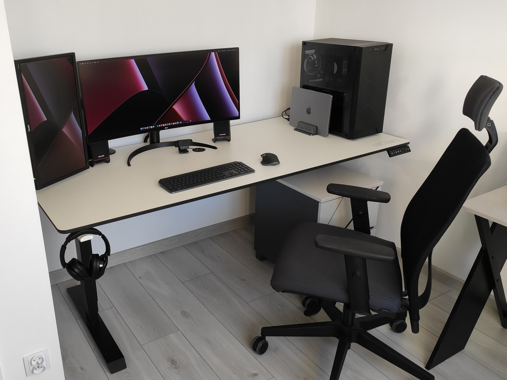
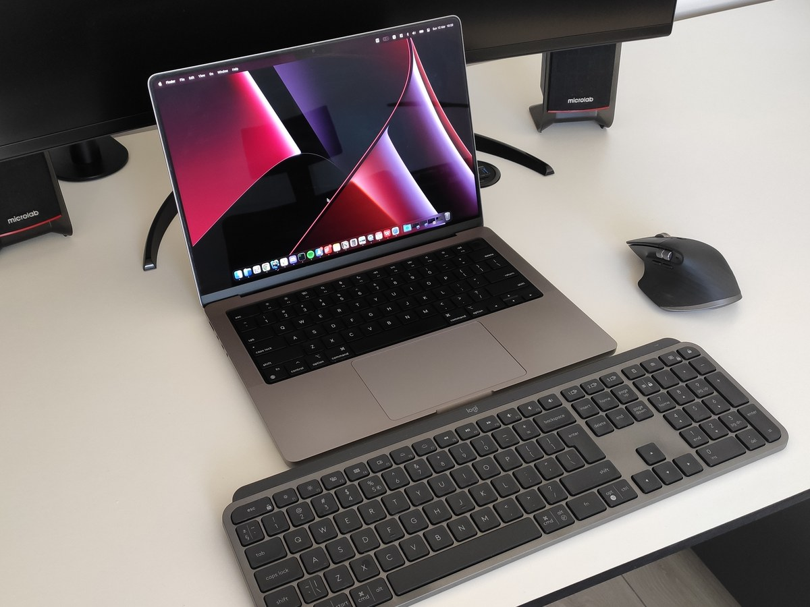
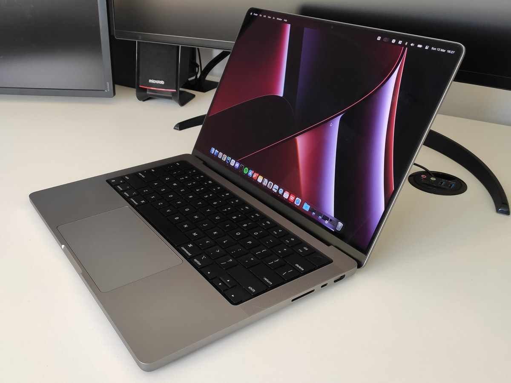
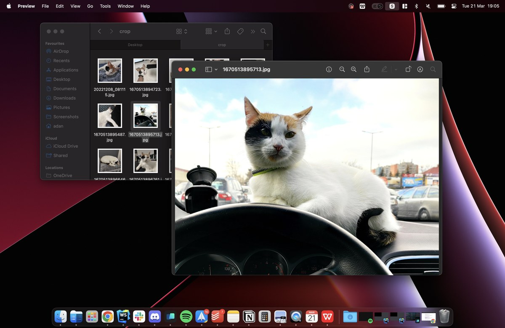
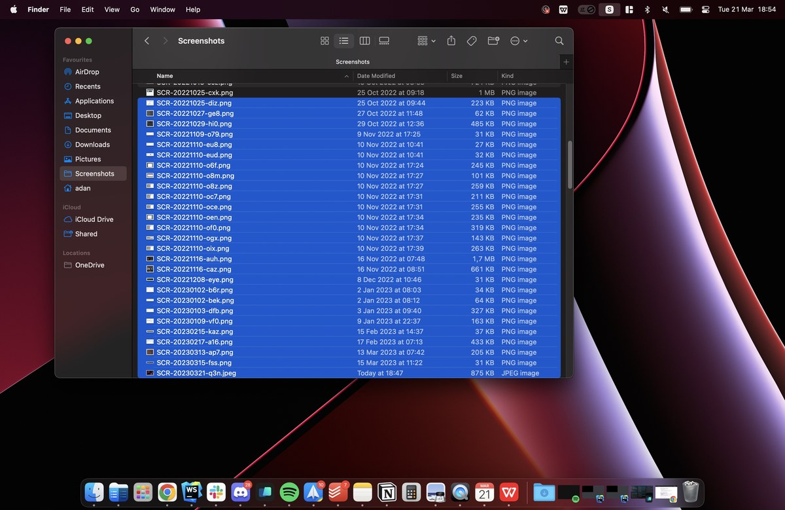
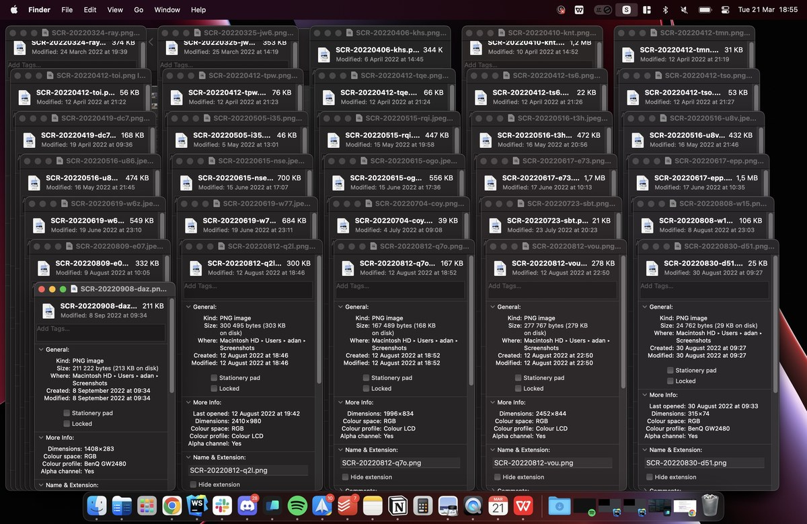

Przez większość życia system Windows był jedynym możliwym dla mnie systemem operacyjnym. Wszelkie próby przejścia i codziennej pracy na różnych dystrybucjach Linuksa ostatecznie kończyły się powrotem na łono Microsoftu. Mimo że wielu deweloperów cały czas korzysta z Windowsa, to dla web deweloperów przesiadka na [systemy z rodziny Unix](/windows-konta-linux-jaki-system-operacyjny-wybrac) jest bardzo pomocna, ponieważ zbliża to nasze komputery do środowiska, w jakim pracują serwery oraz cały Internet.

Na początku zeszłego roku musiałem zmienić pracę i z racji pracy nad dużymi projektami rosły problemy z konfiguracją mojego Windowsa. Musiałem już na okrągło posiłkować się emulacją Linuxa poprzez WSL, a także korzystać z maszyn wirtualnych, co wymusiło wtedy podwojenie posiadanej przeze mnie [pamięci RAM](/pamieci-ram). Kilka tygodni później zaproponowano mi przesiadkę na Macbooka, abym nie musiał już ciągle walczyć z uruchamianiem firmowych projektów. Otrzymałem wtedy 14-calowego Macbooka Pro z 2021 roku z procesorem M1 Pro. Minął już ponad rok, odkąd korzystam z tego sprzętu i dzisiaj chciałbym podzielić się z Wami swoimi przemyśleniami na ten temat. Było to moje pierwsze w życiu spotkanie z ekosystemem Apple, więc sądzę, że może to być ciekawy temat zwłaszcza dla osób zastanawiających się nad taką zmianą.

## STANOWISKO PRACY

Osoby śledzące moje social media zapewne wiedzą, że jestem świeżo po przeprowadzce, więc moje stanowisko wygląda teraz zgoła inaczej, niż w [poprzednich artykułach](/modernizacja-stanowiska-benq-gw2480). Prywatne oraz służbowe rzeczy wykonuję obecnie tylko na Macbooku. Jednostka stacjonarna, która znajduje się obok niego, służy mi jedynie od czasu do czasu, do uruchomiania gier lub gdy potrzebuję popracować w języku C#. Duet od Logitecha, czyli klawiatura MX Keys oraz mysz MX Master pozwalają mi na bezproblemowe przełączanie się pomiędzy obydwoma systemami. Wyposażyłem się również w wymarzone elektrycznie regulowane biurko, aby móc w końcu odciążyć swój kręgosłup podczas pracy. Z racji znacznie większego biurka musiałem również wymienić monitor, aby mógł on stać na jego końcu, a nie zaraz za klawiaturą. Wybór padł na zakrzywiony 34-calowy [monitor UltraWide od LG](/monitory-czesc-1). Jestem z niego bardzo zadowolony i jest nieoceniony, gdy muszę otworzyć wiele plików z kodem źródłowym. Obok mam jeszcze powieszony pionowo stary zasłużony 22-calowy monitor od Benq, na którym najczęściej trzymam drugą przeglądarkę internetową oraz Slacka. Dzięki temu znacznie rzadziej muszę przełączać się między oknami i zawsze mogę szybko zerknąć, kto do mnie napisał lub przeczytać kolejny fragment dokumentacji.

<ImageDescription>Schludnie i minimalistycznie</ImageDescription>

Wszystko na biurku zaprojektowałem tak, aby zminimalizować ilość kabli oraz ułatwić przełączanie się pomiędzy komputerami. MacBook połączony jest ze stanowiskiem jedynie za pomocą dwóch kabli - HDMI oraz USB-C. Ten pierwszy obsługuje mój monitor główny, natomiast USB-C idzie do huba znajdującego się pod biurkiem. Tam podłączony jest mój drugi monitor, kamerka internetowa oraz zasilacz, który ładuje laptopa dzięki funkcji Power Delivery. Dzięki takiemu rozwiązaniu stanowisko wygląda schludnie, a ja mogę w mgnieniu oka odłączyć lub podłączyć laptopa do reszty zestawu.

## WYKONANIE I BUDOWA LAPTOPA

Najpierw trochę o wyglądzie zewnętrznym laptopa. Obudowa jest w całości wykonana z metalu i posiada lekko zaokrąglone krawędzie. Z racji swojej kanciastości ciężko jest go podnieść z blatu jedną ręką, choć jest to kwestia przyzwyczajenia.

Ekran jest rewelacyjny i nie potrafię sobie wyobrazić powrotu do laptopów z [przestarzałymi TN-kami](/monitory-czesc-1). Kolory są żywe, kontrast genialny, a ramki cieniutkie z wszystkich stron. Co do notcha, to nie jestem jego fanem. Może i jest on mało widoczny, gdy znajduje się na ciemnym pasku systemowym oraz tapecie, ale i tak niepotrzebnie dzieli menu otwartych aplikacji. W dodatku włączenie trybu pełnoekranowego sprawia, że zysk powierzchni roboczej jest znikomy, ponieważ fragmenty ekranu po bokach notcha nie są wykorzystywane i pozostają zawsze czarne. Chciałbym zobaczyć w przyszłych modelach kamerkę umieszczoną przy dolnej krawędzi ekranu lub ukrytą w klawiaturze tak, jak to robił Huawei w swoich MateBook’ach.

<InfoBlock>
Powierzchnia matrycy jest błyszcząca i łapie zabrudzenia jak szalona, dlatego lepiej nie dotykać jej palcami. Na szczęście wysoka maksymalna jasność pozwala ukryć smugi na ekranie.
</InfoBlock>

Duży plus należy się wbudowanym głośnikom. Słuchanie na nich muzyki to czysta przyjemność i powiedziałbym nawet, że mają one nawet lepszą dynamikę [od mojego zestawu 2.1 od Microlab](/glosniki-komputerowe), który znajduje się u mnie na biurku. Taki paradoks 😂.

Trackpad to złoto. W końcu rozumiem, dlatego ludzie się nim tak zachwycają. Jest duży, precyzyjny i nie męczy dłoni. Dzięki możliwości wciśnięcia go w dowolnym miejscu można go obsługiwać bez odrywania palca i teraz ciężko mi obsługiwać klasyczne gładziki z fizycznymi przyciskami w dolnych narożnikach. Interpretowanie rozmaitych gestów też działa nienagannie i pomaga w pracy na małym ekranie. Czy faktycznie Trackpad jest w stanie całkowicie zastąpić klasyczną mysz? W przypadku codziennej, wielogodzinnej pracy [dobrze wyprofilowana mysz](/myszy-komputerowe-czesc-1) jest nadal znacznie zdrowszym i rozsądniejszym wyborem. Jednak gdyby zignorować aspekty ergonomii, to tak - applowy Trackpad jest na tyle wygodny, że przestałem podróżować z jakimikolwiek mobilnymi myszami.

<ImageDescription>Macbook Pro wraz z zestawem od Logitecha - MX Keys oraz MX Master</ImageDescription>

## KLAWIATURA

Wbudowana w Macbooka klawiatura jest bardzo dobrze wykonana i przyjemnie mi się z niej korzysta podczas pracy “w terenie”. Czytnik linii papilarnych jest bardzo przydatny, ponieważ umożliwia mi logowanie i wprowadzanie haseł bez używania klawiatury. Z podświetlenia klawiszy praktycznie nie korzystam - użyłem go może z dwa razy. Niestety dużo problemów sprawiło mi przyzwyczajenie się do innych klawiszy specjalnych oraz co za tym idzie, innych skrótów klawiszowych. Dla osób przesiadających się z Windowsa oznacza to niejako naukę pisania od nowa. Dodatkowo różnice w układzie sprawiają, że nie wszystkie [zewnętrzne klawiatury](/klawiatury), które posiadamy, będą chciały współpracować z Macbookami i zmusi nas to do dodatkowych zakupów. Ostatecznie, zmieniony układ klawiatury uważam za największy problem podczas przesiadki z Windowsa na Maca, ale ten temat omówiłem dokładniej w osobnym artykule, do którego możecie przejść przy użyciu przycisku poniżej:

<ActionButton to="/budowa-klawiatury-mackbooka">Porównanie budowy klawiatur od Apple</ActionButton>

## PORTY

Mój Macbook jest już modelem po rewolucji portowej. Poprzednie modele posiadały tylko i wyłącznie gniazda USB-C. Ten, oprócz gniazd USB-C posiada również wejście słuchawkowe, HDMI, czytnik kart SD oraz dedykowane gniazdo magnetyczne ładowarki MagSafe. Największą różnicę robi oczywiście port HDMI, dzięki któremu możemy skorzystać z dodatkowego monitora lub projektora bez bawienia się w śmieszne dyndające przejściówki - INNOWACJA! Gniazdo słuchawkowe przydało mi się wiele razy, a z czytnika kart pamięci nie korzystam, choć domyślam się, że jest ono zbawienne dla wszelkich fotografów lub vlogerów. MagSafe jest fajny, choć teraz często z niego nie korzystam, ponieważ baterię prawie zawsze uzupełniam w docku na biurku. Jedyne, czego jeszcze brakuje w tym laptopie, to chociaż jednego gniazda USB typu A. Czasami nadal go potrzebuję, mimo że wszystkie moje peryferia mam już bezprzewodowe. Mimo to, zestaw portów jest bardzo dobry i fajnie, że nie muszę się bawić w kupowanie dodatkowych przejściówek.

## KULTURA PRACY

Dotychczas laptop był mi potrzebny tylko, gdy musiałem pracować poza domem, ale zawsze gardziłem nim podczas siedzenia w domu, ze względu na jego kulturę pracy. Wolałem bawić się w synchronizowanie aplikacji oraz danych pomiędzy oboma systemami, niż całkowicie przejść na laptopa. Korzystam z Macbooka już ponad rok i nadal nie mogę się nadziwić temu jak ta maszyna cudownie pracuje. Zresztą porównajcie sobie sami.

Uruchamiam laptopa z Windowsem. Stoi sobie spokojnie na pulpicie i odpalają się wentylatory. Nic nie muszę na nim robić, a on i tak robi się już ciepły. Odpalenie przeglądarki, IDE czy, co gorsza, skompilowanie czegoś większego, to oczywiście szum wentylatorów, a wylotu powietrza już nie da się dotknąć. RAM zapełniony pod korek, zrzuty pamięci przywieszają aplikacje, procesy usług szaleją i po szalonych (aż) dwóch godzinach pracy czas podłączyć ładowarkę, aby Microsoft mógł odpalić aktualizację systemu oraz [jeszcze więcej niepotrzebnych procesów w tle](/po-zainstalowaniu-windowsa-10), a laptop zaczął unosić się w powietrzu niczym Harrier podczas pionowego startu. Położenie takiego laptopa na kolanach oczywiście nie wchodzi w rachubę.

Teraz Macbook. Nigdy go nie wyłączam, a jedynie zamykam klapę lub blokuje konto. Działa stabilnie przez wiele tygodni i w 95% wyłączam go tylko na potrzeby aktualizacji systemu. Zużycie RAMu? Wbudowane 16 GB (które Windows połknąłby na śniadanie) starcza nawet na otwarcie wielu przeglądarek oraz środowisk programistycznych. Zrzutów pamięci na dysk kompletnie nie czuć - aplikacje oraz ich animacje ani razu nie tracą płynności. A teraz kwintesencja: laptop jest co najwyżej lekko ciepły i praktycznie nigdy **NIE używa wentylatorów**. Bateria starcza mu zazwyczaj na prawie cały dzień roboczy. Dziękuję, kurtyna.

Nie wyolbrzymiam, na serio ten laptop bije na głowę wydajnością mojego 12-kilogramowego stacjonarnego kloca i jest przy tym całkowicie bezgłośny! Tylko w jednej sytuacji udało mi się uruchomić jego wentylatory (i się przestraszyć nieznanego mi dotychczas dźwięku) i było to podczas używania Dockera w trybie emulacji innej architektury. Rozumiecie? Musiałem go katować emulowaniem kompletnie innego procesora, aby w końcu wydał jakikolwiek dźwięk. W innych przypadkach działa tylko na chłodzeniu pasywnym, jakby był jakimś budżetowym Celeronem.

Dlatego właśnie Windows nigdy nie będzie miał u mnie wstępu na urządzenia mobilne. Wielokrotnie próbowałem zamieniać go na Linuksa i wtedy sprzęt działał bardzo ładnie, ale brak aplikacji prędzej czy później zmuszał mnie do powrotu do “okienek”. iOS to [idealna hybryda obu tych systemów](/windows-konta-linux-jaki-system-operacyjny-wybrac). Oferuje on kulturę oraz energooszczędność Linuksa oraz rozbudowaną bazę aplikacji znaną z Windowsa. Pewnie możecie powiedzieć, że to zasługa ceny tego laptopa i porównuję go ze sprzętem, który był pięć razy tańszy od niego. Tak, był tyle razy tańszy, ale jestem święcie przekonany, że nawet kupując laptopa z Windowsem za około 15k nie byłbym w stanie uzyskać takiej kultury pracy jak na macOS-ie. Po prostu to nie jest wina słabych podzespołów czy małej baterii - Windows ma beznadziejną optymalizację i tego nie da się naprawić kupując droższy model, czy wydając kilka aktualizacji systemu.

## INNE WADY MACOS

No dobrze, macOS jest stabilny i energooszczędny, ale jak się z niego korzysta? Jeśli miałbym go porównać do Windowsa, ale tylko pod względem intuicyjności i produktywności, to powiedziałbym, że Windows wypada odrobinę lepiej, choć ciężko jest to obiektywnie ocenić. MacOS posiada bardzo spójny i minimalistyczny interfejs, który szczególnie przydaje się na małych ekranach laptopów. Nie posiada on archaicznie wyglądających okien jak Windows. Tak, mówię tutaj o wszystkich oknach opcji i właściwości plików, które do dzisiaj rażą brakiem wsparcia dla ciemnego motywu systemu. W dodatku napisane są przy użyciu przestarzałych komponentów Windows Forms, które nie wspierają systemowego skalowania i przez to na laptopach są po prostu rozmazane. Nawet okno zapisu/otwierania pliku dopiero niedawno doczekało poprawki i wsparcia skalowania - wcześniej wyglądały one po prostu jak 💩. Niestety Windows jest pełen takich niedoróbek. **Apple z kolei naprawę pilnuje spójności interfejsu swojego systemu oraz aplikacji i jeśli odświeżają oni wygląd, to robią to globalnie.** Za to należą im się duże brawa.

Minusem macOSa jest za to przełączanie i organizowanie okien. System ten **nie ma zaimplementowanego żadnego przyciągania okien do krawędzi,** które wydawało mi się, że jest już dzisiaj standardem. Okno jest albo zmaksymalizowane, albo trzeba je dostosowywać ręcznie, łapiąc za krawędzie. Ja wytrzymałem tak kilka dni, po czym zainstalowałem płatną [aplikację Magnet](https://magnet.crowdcafe.com/), z której korzystam po dziś dzień - polecam sprawdzić. Zachowanie docka i minimalizowanie aplikacji działa tutaj zupełnie inaczej, niż w Windowsie, ale gdy już go rozgryziemy, to nawet korzysta się z niego nawet przyjemnie. Minusem dla mnie jest natomiast zachowanie fokusowania na oknie. Działa on w taki sposób, że możemy wejść w interakcję tylko z aktywnym obecnie oknem. Reszta jest niejako w tle i reagują one co najwyżej na scroll myszy. Przez to, aby wcisnąć dla przykładu coś na stronie internetowej w przeglądarce, musimy kliknąć przycisk dwa razy - pierwszy aktywuje okno, a dopiero drugi faktycznie naciśnie przycisk. Nadal odrobinę mnie to denerwuje, ale zdążyłem już się do tego przyzwyczaić. Szkoda jednak, że tego zachowania nie da się w żaden sposób zmienić w ustawieniach systemu.

<ImageDescription>Przeglądarka plików nie jest mocną stroną macOS-a</ImageDescription>

A co do ustawień systemu, to jak przystało na Apple, są one bardzo podstawowe i nie pozwalają na wiele personalizacji. Niestety tak samo, jak w iPhone’ach, tak i tu, albo zgadzamy się na ich wizję wyglądu i zachowania systemu, albo mamy problem. Wielu rzeczy nie da się tutaj zmienić albo trzeba łatać braki dodatkowymi aplikacjami. Moją ulubioną dwójką aplikacji jest Scroll Reverser, który pozwala mi zmienić kierunek działania scrolla na myszy bez modyfikacji Trackpada, a także Filmage, który dodał mi do systemu wirtualną kartę dźwiękową pozwalającą nagrywać dźwięk z systemu. Tak - **macOS nie pozwala na nagrywanie dźwięków systemowych** i trzeba się bawić w specjalne obejścia systemowe, aby jakkolwiek to umożliwić 👏. Inny przypadek to sterowanie głośnością audio poprzez HDMI. Wbudowane gniazdo Macbooka na to nie pozwala, ale monitor podłączony do USB-C przez przejściówkę już tak 🤯. Takich małych zaskakujących dziwactw jest tutaj więcej, ale pozwolę zachować je już dla siebie.

## ZARZĄDZANIE PLIKAMI

Za największy minus systemu od Apple uważam sposób przeglądania na nim plików. Do dzisiaj nie mogę się przekonać do wbudowanej przeglądarki plików Finder i wszelkie operacje na plikach to nadal dla mnie droga przez mękę. Próbowałem znaleźć alternatywną aplikację do tego (np. Commander One), ale żadna nie miała dobrej integracji z systemem, a macOS nadal usilnie otwierał wszystko przy użyciu wbudowanego Findera oraz aplikacji Preview. Jeśli macie jakieś sprawdzone metody i aplikacje, to proszę, podzielcie się nimi w komentarzach. Ja tymczasem podam kilka przykładów, co nie podoba mi się w przeglądaniu plików na Macach:

1. Klawisz Enter (return z układu macOS) nie otwiera plików, a zmienia ich nazwy. Aby otworzyć plik, należy użyć skrótu Cmd + strzałka w dół (?!).
2. Inżynierowie Apple nadal nie rozgryźli operacji “wytnij”. Finder pozwala jedynie kopiować i wklejać obiekty przy użyciu schowka, ale nie przenosić. Opcja wycinania co prawda jest widoczna w menu edycji, ale z jakiegoś powodu jest zawsze zablokowana 🤪.
3. Jeśli zaznaczysz kilka obiektów (plików lub folderów), a następnie spróbujesz wyświetlić o nich szczegóły (skrót Cmd+I), to nie dostaniesz informacji o zaznaczonym zbiorze danych tak, jak w Windowsie. Mac otworzy Ci osobne okienko do każdego zaznaczonego pliku i katalogu. A jak zaznaczyłeś ich wiele? No cóż... miłego zamykania armii okienek.
4. Preview nie potrafi otwierać gifów. Pokazuje jedynie pojedyncze klatki animacji, ale nie potrafi jej zaanimować.
5. Zapomnij o zoomowaniu zdjęć w aplikacji Preview. Jak jeszcze korzystasz z trackpada, to nie jest źle. Szczypaniem zbliżasz, a dwoma palcami przesuwasz widok, ale klasyczną myszą już tego nie zrobisz. Przybliżenie dostępne jest tylko z przycisków górnego menu, a przesunięcie widoku jest możliwe tylko przy użyciu suwaków. Poczułem się normalnie, jakbym wrócił do czasów przeglądarki obrazów z Windowsa XP 🤯.

<Gallery>

</Gallery>
<ImageDescription>Radzę uważać z oknem właściwości przy zaznaczonej dużej ilości plików</ImageDescription>

Jeśli chodzi o stabilność i awarie macOSa, to nie jest idealnie, ale bardzo dobrze. Zdarzają się tutaj awarie, ale najczęściej w postaci, że któreś z peryferiów przestaje się dogadywać z systemem. Monitor nie chce się wybudzić lub dźwięk w słuchawkach bezprzewodowych staje się bardzo cichy. Na szczęście nie miałem jeszcze ani jednej awarii, której nie naprawiłby szybki restart systemu. W przypadku Windowsa takie awarie też występują, ale często nie naprawia ich restart maszyny. W dodatku macOS posiada fajną opcję przywrócenia otwartych okien po restarcie systemu, więc możemy szybko wrócić do swojej pracy.

Jeśli chodzi o aktualizacje systemu, to nareszcie nie przyprawiają mnie one o zawał serca. MacOS stosuje standardowe przejrzyste numerowanie aktualizacji oraz często podaje listę zmian, jakie wprowadza. Najważniejsze jednak, że nie wymusza czasu na ich instalacje. **To użytkownik decyduje, kiedy chce je zainstalować.** W dodatku jeszcze nie zdarzyło mi się, aby system miał problemy ze wstaniem po aktualizacji. Jest to naprawdę cudowne uczucie nie bać się w końcu komunikatów o aktualizacji. W Windowsie nigdy niewiadome było, kiedy i co się zaktualizuje. Instalacje były wymuszane, a tajemniczo numerowane łatki wgrywały się w losowej kolejności. Moją ulubioną sytuacją było zawsze aktualizowanie sterowników sieciowych i graficznych w Windowsie. Microsoft nie obchodziło, że aktualnie pracujesz na komputerze, prowadzisz konferencje, czy operujesz aparaturą medyczną. **Windows potrafił ot tak wyłączyć sobie kartę sieciową lub ekran**, aby tylko zainstalować sobie nowszy sterownik.

## PODSUMOWANIE

To wszystko, co miałem Wam dzisiaj do przekazania. Kiedy polecam pomyśleć o przejściu na Macbooka? Przede wszystkim, gdy robi Ci się niedobrze na widok pracoholika Windowsa, który zawsze musi coś mielić w tle. MacOS jest znacznie stabilniejszym systemem, a odkąd przeszedł on na architekturę ARM oraz autorskie procesory M1/M2, jest królem wydajności, a mimo to potrafi wytrzymać na baterii wiele godzin. Jeśli natomiast nie przeszkadzają Ci problemy Windowsa oraz cenisz sobie bogate opcje personalizacji, to zapomnij o macOS-ie. Przejście na ekosystem Apple wymaga nauczenia się korzystania z komputera na nowo, możliwości personalizacji jest jak na lekarstwo, a cena urządzeń tego producenta w Polsce jest nadal bardzo wysoka, co sprawia, że wypróbowanie tego sprzętu jest bardzo kosztowne.

Bardzo cieszę się, że otrzymałem okazję do skorzystania z tego sprzętu. Na reszcie nie muszę korzystać z dwóch różnych urządzeń i mogę się cieszyć się super wydajnością oraz długim czasem działania na baterii, gdy muszę opuścić moje standardowe miejsce pracy. Obawiam się, że moja przygoda z Windowsem zakończyła się już na dobre. Oczywiście nadal towarzyszy mi on na wielu urządzeniach, ale aktualnie wątpię, żeby kiedyś zagościł on na mojej głównej maszynie. A jak to wygląda u Was? Korzystacie lub korzystaliście z Macbooków? Jakie są Wasze przemyślenia? Zapraszam do sekcji komentarzy 🙂.
