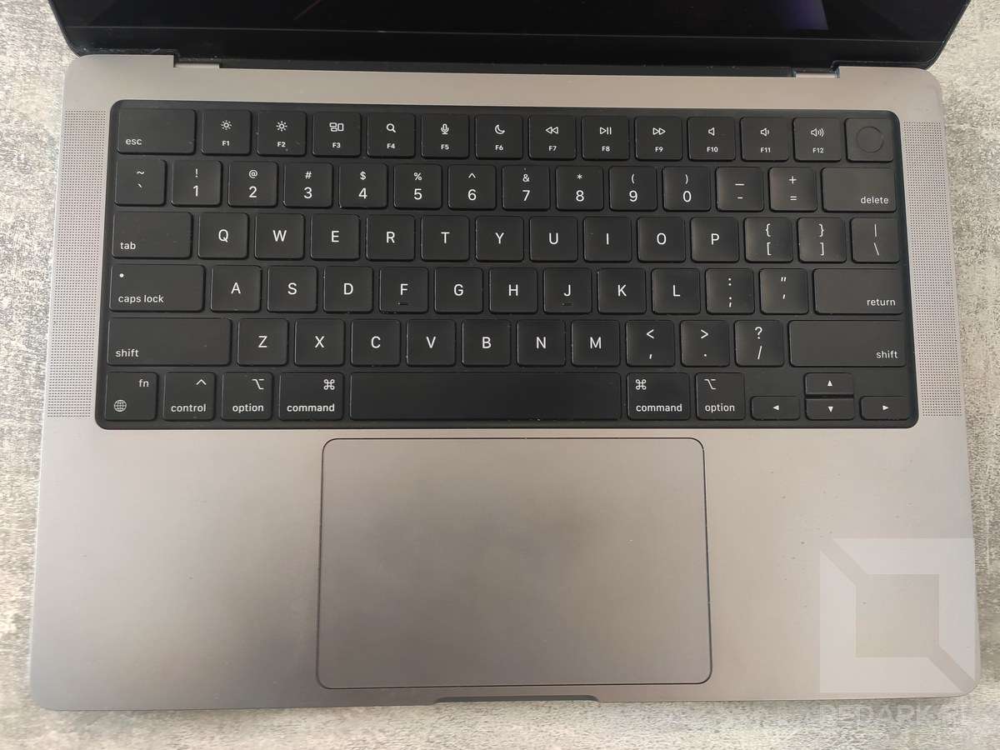
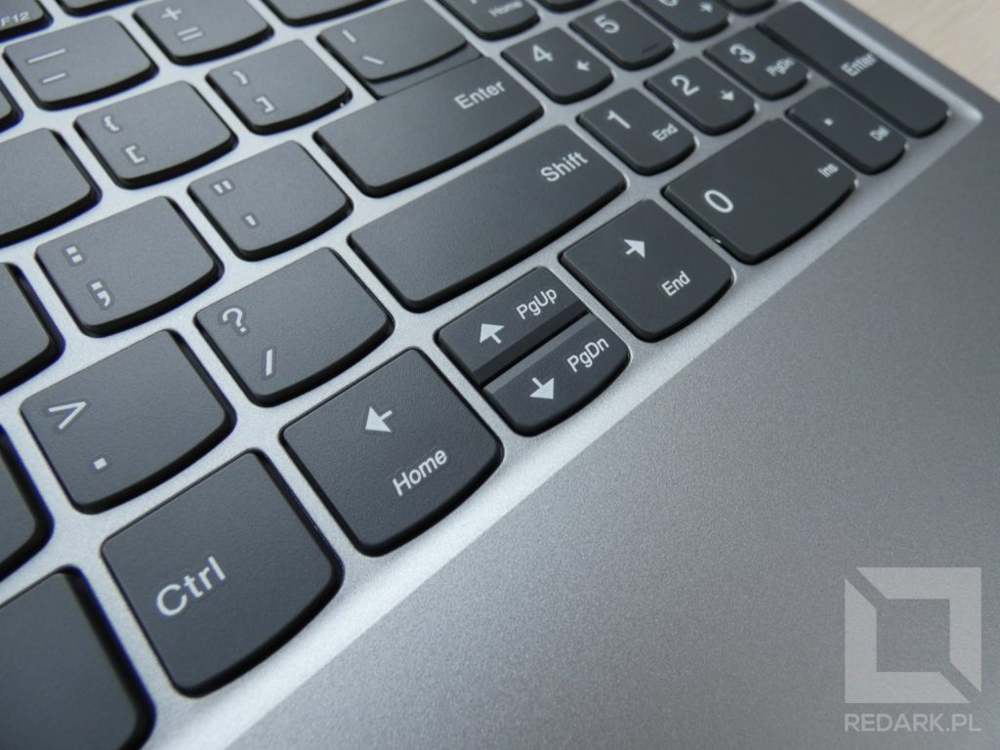
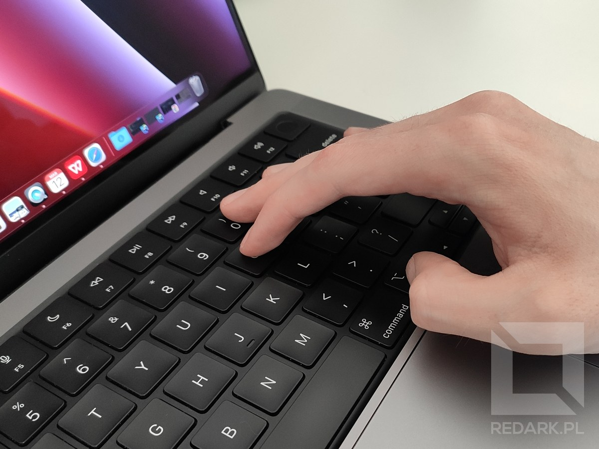
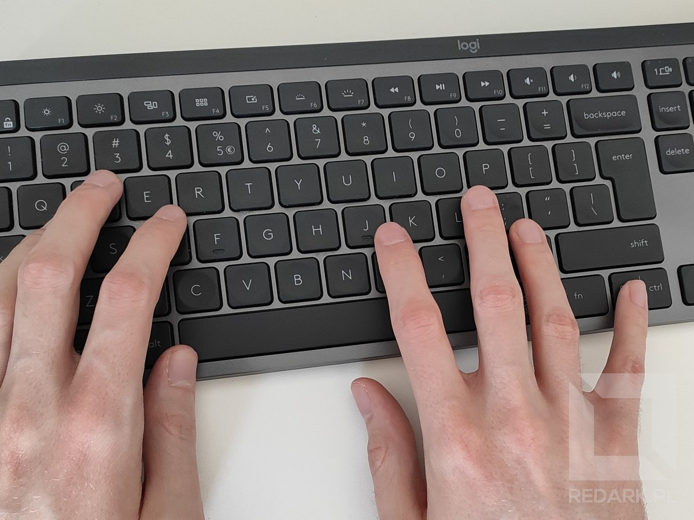
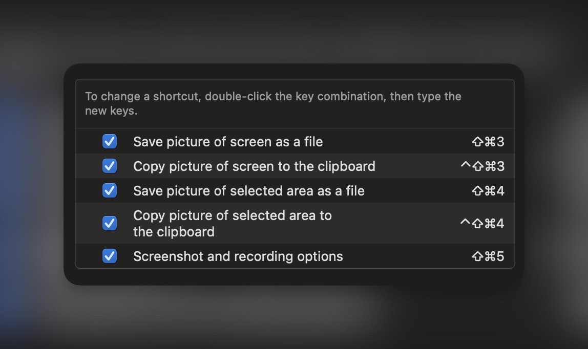
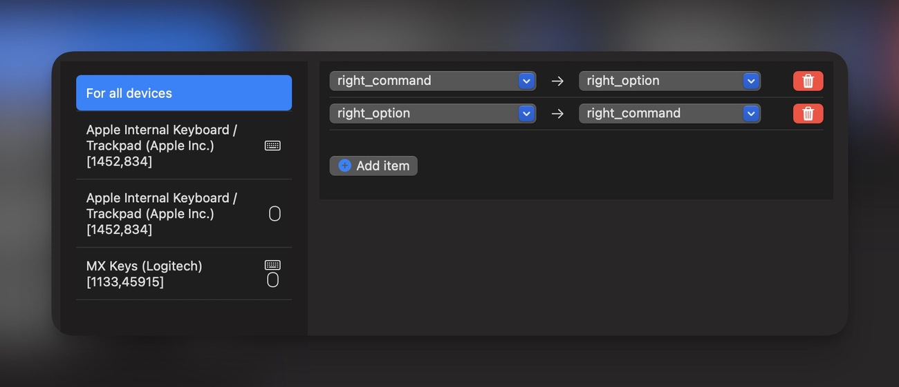
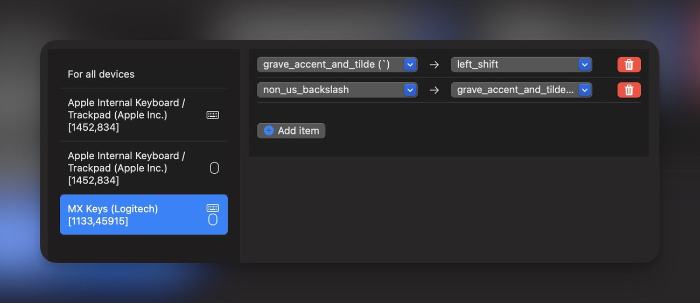

[Ostatnio na Redarku podzieliłem się](/windows-kontra-macos-macbook-pro) z Wami moimi przemyśleniami na temat przesiadki z Windowsa na macOS. Jedną z trudniejszych rzeczy w tym procesie było przyzwyczajenie się do odmiennego układu klawiatury oraz innych klawiszy specjalnych. Pewnie część osób nie jest nawet świadoma, że komputery Apple posiadają niestandardowe klawiatury, których nie znajdziemy nigdzie indziej. Jeśli planujesz przesiadkę na ekosystem Apple lub po prostu chcesz poznać różnice w budowie klawiatur, zapraszam do artykułu.

## Zmienione nazewnictwo

Na początek wyjaśnienie kwestii nazewnictwa kilku klawiszy. Znana z Windowsa trójca klawiszy skrótów: Control (Ctrl), Windows (Win) oraz Alt; w ekosystemie Apple zamieniona została na: Control, Option (opt) oraz Command (cmd). Control pozostaje bez zmian, logo Windowsa zamienia się w Option, a Alt w Command. Zwróć uwagę na skrótowe nazwy klawiszy, jakie podałem w nawiasach. Frazy opt oraz cmd są bardzo często używane podczas podawania skrótów na stronach internetowych. Dodatkowo każdy z omawianych klawiszy posiada specjalny znak graficzny, który wyróżnia go w systemie. Warto zapamiętać te symbole, aby móc łatwo rozpoznawać i wywoływać skróty pokazywane na ekranie komputera.

<ImageDescription>
Klawiatura wbudowana w Macbooka Pro z 2021 roku
</ImageDescription>

Najważniejszą rzeczą, o której musisz wiedzieć przesiadając się na Macbooka, jest to, że **Command stanowi główny klawisz do wywoływania skrótów**, a nie Control, tak jak to miało miejsce w przypadku Windowsa. Bardzo wiele aplikacji posiada skróty pod tymi samymi literami, co na Windowsie, ale z tą równicą, że są one łączone z klawiszem Command. Tak samo jest z najpopularniejszymi skrótami - wytnij, kopiuj i wklej. Zamiast wywoływać je z Controlem, należy użyć Commanda. Wymaga to kilku dni na przestawienie się, ale nie jest to niemożliwe.

Dwie pozostałe różnice w nazewnictwie klawiszy są na szczęście czysto kosmetyczne, a ich działanie jest niemal identyczne, jak na Windowsie. Mowa tutaj o klawiszu kasowania Backspace, który w macOS nazywa się **Delete** oraz o klawiszu Enter, który tutaj nazywa się **Return**. Klasyczny klawisz Delete, który odpowiedzialny jest za usuwanie znaków na prawo od kursora, jest tutaj oznaczany odbitą lustrzanie ikonką strzałki z krzyżykiem.

## Klawisze funkcyjne odchodzą do lamusa

MacOS stroni od korzystania z klawiszy funkcyjnych F1-F12. Nie zostały one usunięte z klawiatur Apple i nadal znajdują się w pierwszym wierszu od góry, ale ich domyślną akcją są skróty do sterowania systemem oraz odtwarzaczem muzyki. Dostęp do nich możliwy jest dopiero po przytrzymaniu klawisza FN, podobnie jak to ma miejsce w laptopach z systemem Windows. Nie uważam tego za zły zabieg, ponieważ skróty systemowe są bardzo przydatne i często z nich korzystam. Należy jedynie pamiętać, że wszystkie skróty typu F5 (odświeżanie strony internetowej), które znamy z Windowsa, powędrowały gdzieś w inne miejsce i trzeba je sobie odnaleźć.

<InfoBlock>
W MacOS stronę internetową można odświeżyć przy pomocy skrótu Cmd+R (ang. Reload), a narzędzia deweloperskie spod klawisza F12 dostępne są pod Cmd+Opt+I (ang. Inspect). Tak samo jest z pozostałymi skrótami.
</InfoBlock>

## Nawigowanie kursorem

Osoby dużo piszące na komputerze, zapewne często posługują się skrótami do przenoszenia kursora. Mówię tu przede wszystkim o bloku znajdującym się standardowo nad klawiszami strzałek. Znajdujące się tam Home, End, Page Up oraz Down działają inaczej w systemie macOS. Dodatkowo nie znajdziemy ich w klasycznym układzie klawiatury Macbooków. Preferowanym stylem operowania kursorem w ekosystemie Apple jest korzystanie tylko i wyłącznie ze strzałek i łączenie ich z klawiszami Option lub Command. Dla przykładu Home i End to tutaj strzałki lewo/prawo z przytrzymanym Commandem. Podobny zabieg oferują laptopy z Windowsem, ale tam korzysta się z klawisza FN do wywołania drugiego znaczenia strzałek. Tak jest w [Lenovo, którego używałem](/recenzja-laptopa-lenovo-ideapad-s340-15) przed przesiadką na Macbooka.

<ImageDescription>
Skróty pod strzałkami na przykładzie mojego dawnego Lenovo IdeaPad S340-15
</ImageDescription>

Jeśli korzystasz z pełnej zewnętrznej klawiatury, pamiętaj, że nie będziesz często sięgać do bloku klawiszy nad strzałkami. Oczywiście możesz je przemapować i spróbować dostosować ich działanie do tego znanego z Windowsa, ale jest to trudne i nie da się tego zrobić jeden do jednego. Na szczęście zaznaczanie tekstu oraz obiektów nadal znajduje się pod Shiftem, a przeskakiwanie co wyraz zostało jedynie przeniesione z Controla na Option.

## Polacy nie gęsi i swoje ogonki mają

Dla nas, Polaków, ważna jest kwestia stawiania specjalnych znaków dialektycznych. W układzie od Apple nie posiadamy klawisza Alt, a znajdujący się w jego miejscu prawy Command do tego nie służy. **Polskie znaki wprowadza się za pomocą prawego Option.** Ta zmiana jest dla mnie sto razy gorsza i problematyczna niż skróty na Commandzie. Po pierwsze podczas pisania artykułów lub odpowiadania komuś nie ma czasu na zastanawianie się, który klawisz odpowiada za polskie znaki i palec odruchowo idzie w miejsce Alta. Powoduje to dziury w tekstach oraz przede wszystkim **przypadkowe aktywowanie skrótów w wielu aplikacjach, a nawet ich zamknięcie** - w końcu to klawisz skrótów Command. Po drugie ja zawsze wciskałem Alt za pomocą prawego kciuka, który spoczywa normalnie na końcu spacji. W przypadku wbudowanej klawiatury MBP klawisz Option znajduje się zaraz obok prawego Commanda, więc nie jest to duża odległość, choć ja przez kilka dni próby przestawienia się na niego dorobiłem się bólu stawu kciuka od jego ciągłego podwijania. W przypadku klawiatury Logitech MX Keys, która jest bardzo popularna wśród programistów, prawy Option znajduje się na samym końcu bloku liter - obok strzałek nawigacyjnych. Sięgnięcie go kciukiem jest awykonalne i jedyną opcją jest skorzystanie z małego palca, co jest dla mnie kompletnie niewygodne i nieintuicyjne. Ostatecznie po kilku dniach walki poddałem się i za pomocą aplikacji Karabiner podmieniłem działanie prawego Commanda z Option, więc używam polskich znaków identycznie, jak na Windowsie. Więcej na temat tej aplikacji opowiem później w tym artykule.

<Gallery>

</Gallery>

<ImageDescription>
Stawianie polskich znaków na klawiaturze Macbooka oraz Logitech MX Keys
</ImageDescription>

## Moja opinia na temat klawiatury Apple

### Niepotrzebne udziwnienia

Przesiadka z Windowsa na Macbooka nie jest łatwa głównie ze względu na zmieniony układ klawiatury. Jest to najczęstszy problem zgłaszany przez użytkowników Windowsa. Choć niektóre zmiany zaproponowane przez Apple są ciekawe i pewnie usprawniają korzystanie z systemu w wielu sytuacjach, to jednak zmieniony układ wymusza naukę obsługi komputera na nowo. Przyzwyczajenie się do nowego układu oraz skrótów wymaga dużo czasu i wysiłku, a konieczność kupowania specjalnych wersji klawiatur zewnętrznych z dostosowanym układem oraz etykietami generuje dodatkowe koszty. Dodatkowo wybór takich klawiatur nadal nie jest zbyt duży, a na pewno nie w Polsce. Najbardziej popularne są produkty Logitecha oraz mechaniczne klawiatury Keychron. Ja początkowo zakupiłem model Keychrom K8, ale zawiódł mnie on swoim wykonaniem, a jakby było tego mało, to przyszedł z uszkodzonym jednym klawiszem Shift. Ostatecznie skończyłem z Logitechem MX Keys, który, choć ma problemy z oprogramowaniem, to ma rewelacyjny czas pracy na baterii oraz dobrą jakość wykonania.

### Brak spójności i logiki w skrótach

Choć korzystanie ze skrótów w macOSie nie stanowi już dla mnie większego problemu, to nadal uważam, że wywoływanie ich przy użyciu Controla było odrobinę wygodniejsze. Po pierwsze klawisz ten znajduje się zazwyczaj w samym narożniku całej klawiatury, więc jest łatwiejszy do namierzenia i ciężko w niego spudłować. Po drugie, najpopularniejsze trio skrótów, czyli kopiuj, wytnij oraz wklej, lepiej obsługuje się na Windowsie, ponieważ klawisze są oddalone od Controla i nie trzeba dziwnie krzyżować palców.

Mam też wrażenie, że **skróty w aplikacjach na macOS są znacznie mniej spójne.** W Windowsie podstawowe skróty znajdują się na Controlu, alternatywne na Alcie, a znaczek Windowsa służy tylko i wyłącznie do operowania systemem operacyjnym. Na Macu to niestety wolna amerykanka. Raz skróty są na Cmd, raz na Option, raz na Control, a i kombinacja wszystkich trzech klawiszy jednocześnie to nic niezwykłego. Gdy dochodzi jeszcze do tego Shift, to głowa zaczyna parować 🤯. Moim ulubionym przykładem są tutaj domyślne skróty do robienia screenshotów, które wymaga użycia trzech lub czterech klawiszy jednocześnie i bynajmniej nie są one umieszczone obok siebie. Rozumiem ideę Apple dążenia do jak najmniejszej ilości klawiszy na klawiaturze, no ale coś tu momentami jest bardzo nie tak i w głębi serduszka mocno tęsknie za spójnością Windowsów w tej kwestii.

<ImageDescription>
Kto to wymyślał?!
</ImageDescription>

### Moje ustawienia Karabinera

Na koniec chciałbym Wam zaprezentować moją małą konfigurację Karabinera, z której korzystam u siebie. Aplikacja jest dostępna do pobrania [z tej strony](https://karabiner-elements.pqrs.org/) i wykorzystuję ją do dwóch rzeczy.

Po pierwsze podmieniam prawy Command z prawym Option, aby móc normalnie stawiać polskie znaki dialektycznie. Pamiętajcie, żeby na pewno wybrać pozycje z przedrostkiem “right_”, aby nie zmodyfikować sobie działania lewego Commanda.

Druga opcja odnosi się tylko do klawiatury Logitech MX Keys (trzeba wybrać ją w menu po lewej). Niestety w Europie Logitech sprzedaje swoje klawiatury tylko i wyłącznie z beznadziejnym dla mnie układem międzynarodowym, który można rozpoznać po krótkim Shiftcie z lewej strony. Aby choć trochę umilić sobie korzystanie z tego układu, podmieniłem znajdujący się tam backslash z tyldą na Shift (aby uniknąć przypadkowego nietrafiania w Shift), a tyldę przeniosłem w jej klasyczne miejsce pomiędzy Escapem a Tabem. Trochę dziwne, ale robi robotę i nie odczuwam teraz problemów z pisaniem na Logitechu.

## Podsumowanie

To już wszystko, co miałem Wam do przekazania. Przesiadka nie była łatwa, ale cieszę się, że mam to już za sobą. Jak Wy oceniacie zmiany wprowadzone przez Apple? Były konieczne, czy to tylko zbędne udziwnienia, aby wyróżnić się na rynku? Dajcie znać w komentarzach.

<GoodList>
- Minimalizm, brak niewykorzystanych klawiszy
- Personalizacja skrótów w systemie oraz zewnętrzną aplikacją
- Przydatne skróty opcji systemowych
</GoodList>

<BadList>
- Utrudnione kupowanie zewnętrznej klawiatury
- Problematyczne przełączanie się między Windowsem a Mackiem
- Zmieniony klawisz do polskich znaków, inny klawisz skrótów
- Mniejsza spójność skrótów oraz skomplikowanie kombinacje
</BadList>
