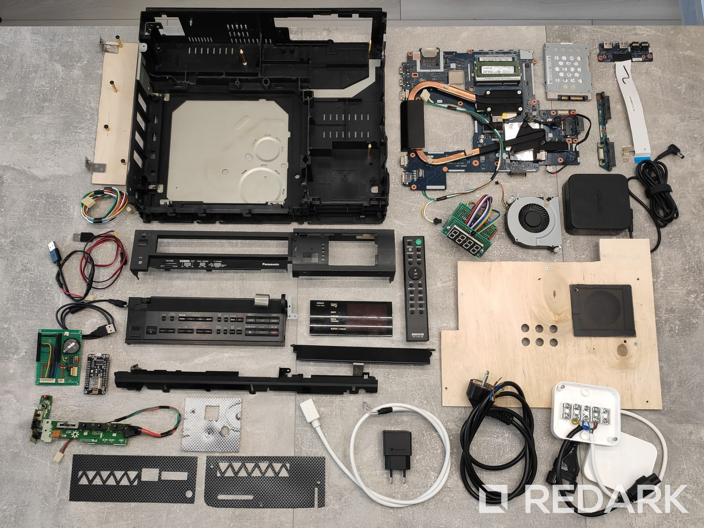
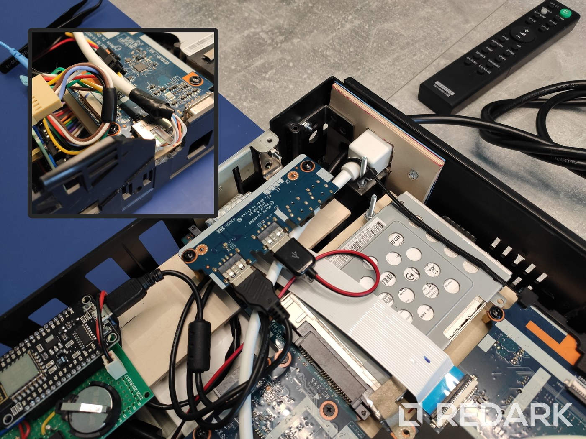

Pod koniec 2021 roku pokazywałem Wam [mój sposób na komfortowe korzystanie z Twitcha na telewizorze](/twitch-tv-bttv-htpc-dell-wyse-5070). Wtedy do tego celu używałem poleasingowego terminala Dell Wyse 5070. Sprawował się on całkiem nieźle i był całkowicie bezgłośny. Niestety brak akceleracji sprzętowej na Linuxie sprawiał, że rozdzielczość 720p wyciskała z niego siódme poty, a instalacja Windowsa ze wsparciem owej akceleracji prędzej czy później kończyła się awariami połączonymi z wyciekami pamięci operacyjnej. Minusem było również ciągłe podchodzenie do jednostki, aby móc ją włączyć.

Wiedziałem, że prędzej czy później będę musiał znaleźć nowy, mocniejszy sprzęt do oglądania transmisji online. Dodatkowo miałem w planach zbudowanie własnego systemu smart home, do którego terminal Wyse były idealny. Najprostszym zastępstwem byłby zwykły składak z miniaturową płytą w standardzie ITX i obudową typu SFF. Tylko że zbudowanie takiego komputera w jak najmniejszym rozmiarze generuje bardzo duże koszty, a ja nie chciałem kupować kolejnej jednostki. Dlatego postanowiłem wykonać kolejny projekt DIY i wykorzystać sprzęt, który już posiadam, dając mu drugie życie.

Tak oto narodził się projekt VHS HTPC. Dawcą podzespołów miał być stary laptop mojej siostry, który niedawno przeszedł na emeryturę. Musiałem jedynie znaleźć urządzenie RTV, które pomieści płytę laptopa i będzie się dobrze prezentować się pod telewizorem. Przeglądałem Olx oraz lombardy w poszukiwaniu starych dekoderów oraz odtwarzaczy DVD, ale albo miały one zbyt małe wymiary, albo nie pasował mi ich wygląd. Wtedy przypomniałem sobie o starym odtwarzaczu VHS, który jako dziecko oglądałem u dziadka. Był idealny - duży, elegancki, minimalistyczny i nie musiałem go kupować w ciemno przez Internet. Dodatkowo był to idealny sposób na przedłużenie żywota urządzenia, które za niedługo pewnie trafiłoby na śmietnik.

Za nim przejdę do omówienia budowy i działania urządzenia, krótka prezentacja jego możliwości w formie krótkiego wideo:

<YouTube id='vgGN3KrSJ-c' title='VHS HTPC Project'></YouTube>

## Przygotowania do projektu

### PANASONIC NV-J35HQ - biorca

Pracę nad projektem rozpocząłem od demontażu magnetowidu, aby przekonać się, co znajduje się w jego środku i jakie problemy mogę napotkać podczas dokonywania przeróbek. W Internecie znalazłem jedynie dwa zdjęcia pokazujące ogólnie jego budowę wewnętrzną, więc do samego otwarcia nie byłem pewny, czy ten model nada się do mojego projektu. Wiedziałem jedynie, że jest on odpowiednio duży oraz posiada minimalistyczny front, na którym bardzo mi zależało. Gdyby front urządzenia miał wiele przycisków, to kusiłoby mnie podłączyć i wykorzystać je wszystkie 😀, a tutaj widoczny jest tylko przycisk Power, a reszta “klawiaturki” schowana jest pod klapką.

Urządzenie pochodzi z przełomu lat 80./90. ubiegłego wieku i muszę przyznać, że zaskoczyło mnie poziomem skomplikowania. Oczywiście widać tutaj małozaawansowaną miniaturyzację elektroniki oraz brak wielowarstwowych płytek drukowanych, ale sam projekt urządzenia jest fascynujący. Najbardziej zaskoczyła mnie płyta główna, która została zlutowana z wielu płytek i tworzy półotwarty prostopadłościan, aby zmieścić się w obudowie 🤯. Pod tym względem dzisiejsze urządzenia są nudne - wewnątrz widzimy tylko jedną malutką płytkę, na której niewiele da się zobaczyć gołym okiem.

Po pierwszym przyjrzeniu się VHS-owi uznałem, że po kilku przeróbkach oraz wycięciu przeszkadzających wewnętrznych plastikowych ścianek nada się on do mojego projektu. Zmartwiły mnie jedynie uszkodzenia widoczne na frontowym panelu. Choć byłem ich świadomy, widząc je odkąd sięgam swoją pamięcią, to okazały się bardziej rozległe, niż to było widoczne z zewnątrz. Ewidentnie urządzenie zaliczyło kiedyś upadek i oprócz zdartych kantów oraz zarysowanego szkiełka znalazłem też kilka połamanych plastików. Cały front okazał się trzymać na słowo honoru, ponieważ 2 z 4 bocznych zaczepów było kompletnie urwanych.

Rozważałem próbę odrestaurowania frontu i pomalowania go na nowo, ale gdy ukończyłem projekt, uznałem, że uszkodzenia jednak nie rzucają się aż tak w oczy, gdy sprzęt stoi wsunięty w szafkę pod telewizorem. Ostatecznie postanowiłem jedynie wzmocnić klejem niektóre pęknięcia w środku i może kiedyś spróbuję lekko przeszlifować uszkodzone kanty. Ryzyko otrzymania gorszego efektu było wysokie, a jednak cenię sobie oryginalny wygląd tego magnetowidu.

### ASUS K75VJ - dawca

Po obudowie trzeba się zająć dawcą współczesnych podzespołów, którym miał zostać laptop Asus K75VJ. Choć ma on już swoje lata, to posiada on porządny procesor Intel Core i7 oraz dedykowany układ graficzny, więc nawet i dzisiaj potrafi on zaskoczyć swoją mocą. Oprócz tego miał zdemontowaną baterię (była uszkodzona i bez problemu działał bezpośrednio na zasilaczu), przerywającą wiązkę wyświetlacza, stary dysk talerzowy oraz problemy z przegrzewaniem się. Ciężko więc było już z niego korzystać, jak z komputera przenośnego, ale problemy, które go trapiły nie wykluczały go z zostania urządzeniem typu HTPC. Bateria i ekran były niepotrzebne, dysk można było wymienić w końcu na SSD, a rozbiórka laptopa, to był idealny moment na czyszczenie układu chłodzenia. Jedyną moją obawą był rozmiar jednostki. Jest to duży 17-calowy laptop wyposażony w dwa gniazda na dyski 3.5-cala. To powodowało, że płyta główna w tym modelu jest bardzo duża i długa, więc mogę mieć problem ze zmieszczeniem jej do obudowy VHSa.

### Pierwsze przymiarki i modyfikacja obudowy

Początkowy plan zakładał, aby zamontować płytę główną laptopa prostopadle do frontu urządzenia. Dzięki temu porty byłyby wyprowadzone od razu na tył jednostki, a w klapce kaset mógłbym zamontować wtedy panel z USB oraz portami audio. W pozostałej części obudowy bez problemu zmieściłby się zasilacz oraz moja jednostka sterująca. Niestety spełniły się moje obawy co do rozmiaru płyty Asusa. Nawet po zdemontowaniu odkręcalnej części PCB z portami SATA dysków twardych płyta główna ledwo mieściła się w obudowie. Miałbym zatem kłopot z wykonaniem mocowań oraz musiałbym kombinować z alternatywnym podłączeniem dysku SSD do jednostki.

Pomysły na rozwiązanie problemu z dyskiem były dwa. Pierwszy polegał na znalezieniu elastycznej taśmy z gniazdem zastosowanym pomiędzy obydwiema częściami płyty głównej, abym mógł zamontować dyski w innej płaszczyźnie nad lub pod płytą. Niestety nie znalazłem nigdzie takiego rozwiązania. Drugi pomysł skupiał się na wykorzystaniu gniazda mini-SATA od napędu optycznego. Wybór elastycznych przedłużek typu męskiego do mini-SATA okazał się bardzo znikomy, a też nie miałem pewności, że ASUS bez problemu uruchomi system ze swojego “napędu optycznego”. Drugi pomysł również upadł, więc zostałem zmuszony kompletnie zmienić koncepcję całego urządzenia.

Płyta główna musiała zatem zostać umieszczona równolegle do frontu. Okazało się, że przy takim ułożeniu pozwoli mi to podłączyć nawet oryginalne gniazda SATA laptopa. Musiałem jedynie bardzo dokładnie wykonać otwory montażowe, ponieważ luzu na szerokości obudowy zostało mi może z 2-3 milimetry 😂. Choć taki wariant prac rozwiązywał mój problem z dyskami, to oczywiście pojawiły się inne problemy. Porty musiały zostać wyprowadzone z boku urządzenia, a także w samej obudowie zostało już bardzo niewiele wolnego miejsca, które mógłbym przeznaczyć na resztę osprzętu. Musiałem mocno przeanalizować i przekształcić swoje pomysły, aby zaadaptować je do nowej sytuacji.

<Gallery>

</Gallery>

Gdy projekt urządzenia się wyklarował, przeszedłem do ostatecznych przymiarek i zaznaczania miejsc w obudowie, które muszę zmodyfikować. Tutaj po raz pierwszy użyłem mojej nowej zabawki, czyli mini szlifierki Dremel 3000. Jej pomoc była nieoceniona i raz-dwa pozbyłem się blokujących mnie plastikowych wzmocnień. W późniejszym etapie pracy, gdy płyta była już zamontowana, wyciąłem również prawą ściankę pod panel portów oraz otwór w metalowej osłonie obudowy.

## Montaż jednostki

Budowa urządzenia składa się z wielu różnych elementów ułożonych jedne nad drugimi. Aby ułatwić opisanie Wam budowy oraz działania urządzenia postanowiłem, że będę go omawiał wraz ze zdjęciami wykonanymi podczas ostatecznego montażu podzespołów. Oczywiście w trakcie projektowania i wykonywania tego HTPC demontowałem i montowałem podzespoły wielokrotnie, aby dobrze spasować wszystkie elementy oraz zwalidować moje pomysły. To, co zobaczycie poniżej, jest owocem całej mojej pracy nad tym projektem i jest jego ostateczną wersją.

<Gallery>

</Gallery>

### Zaślepki oraz rozdzielacz zasilania

Zaczynamy od pustej obudowy. Na pierwszy ogień muszą pójść zaślepki oryginalnych dwóch otworów urządzenia. Ta po prawej wykonana została z wieczka po pudełku po lodach. Plastik, z którego są wykonane, jest cienki, wytrzymały i jednocześnie łatwy w obróbce. Wykonałem w nich kratki wentylacyjne - dolny jest wlotem powietrza dla procesora, a górny odprowadza ciepło nagromadzone nad płytą główną. Zaślepka otworu po lewej to również wieczko po pudełku lodów, ale wzmocnione od tyłu kawałkiem sklejki. Pozwoliło mi to na bardzo solidne mocowanie pod kwadratowe gniazdo Ethernet oraz gumowy przepust dla kabla zasilającego.

<InfoBlock>
Główny kabel zasilający początkowo miał być odłączalny, ale brak miejsca w tym miejscu oraz niewielki oryginalny otwór obudowy nie pozwolił mi na montaż dużego standardowego gniazda zasilania.
</InfoBlock>

Po przełożeniu kabla przez gumowy przepust mogłem zamontować rozdzielacz zasilania 230 V, który wykonałem z puszki natynkowej do przyłączy kuchenek indukcyjnych. Z rozdzielacza wychodzą dwa przewody. Pierwszy jest kontynuacją kabla zasilającego laptopa, do którego będzie podłączony jego oryginalny zasilacz. Drugi posiada zwykłe płaskie gniazdko sieciowe, które będzie zasilać starą ładowarkę USB, a tym samym układ sterujący z zegarem, gdy laptop jest wyłączony. Alternatywnie myślałem o użyciu regulowanej przetwornicy napięcia, którą wpiąłbym pomiędzy zasilacz a laptopa, ale zdecydowałem się nie ingerować niepotrzebnie w układ zasilający komputer i postawić na całkowite odizolowanie obydwu urządzeń.

### Instalacja płyty głównej w obudowie

Po podłączeniu obydwu zasilaczy do rozdzielacza i ułożeniu ich jak najbardziej możliwie płasko na dnie obudowy przyszedł czas na zainstalowanie płyty głównej laptopa. Osadzona jest ona przy pomocy dystansów na kawałku odpowiednio wyciętej sklejki. Do obudowy mocują ją trzy długie dystanse, które mogliście zobaczyć na powierzchni dna obudowy. Czwartą “nogę” sklejki stanowi leżący pod nią zasilacz, który idealnie wypełnia dostępną tam przestrzeń. Na powierzchni deski znajdują się też otwory pod montaż aktywnego chłodzenia procesora. Otwór wlotowy został zabezpieczony filtrem powietrza, który można zdemontować dzięki zastosowaniu taśmy magnetycznej - tak, jak to ma miejsce w standardowych obudowach ATX.

### Boczna półka na podzespoły

Jak mówiłem na wstępie, takie ułożenie płyty głównej zabrało mi bardzo dużo cennego miejsca, które miało być przeznaczone na mój autorski układ sterowania. Problem ten rozwiązałem, wykonując ze sklejki wąską półkę przymocowaną do lewej ścianki obudowy. Po jej przykręceniu i przed montażem podzespołów zainstalowałem jeszcze brakującą część płyty głównej Asusa z gniazdami SATA. Jej koniec spoczywa na półce ze sklejki, więc nie dało się tego zrobić wcześniej. Gdy gniazda SATA były już na miejscu, można było zainstalować dysk SSD.

Po tym zabiegu, na powierzchni sklejki przymocowałem płytkę z portami USB oraz Audio (oryginalnie prawa strona laptopa). Dzięki ułożeniu jej do góry nogami taśma sygnałowa nie jest mocno napięta, a ja mam łatwy dostęp do gniazd USB z wewnątrz obudowy (będą mi one potrzebne później). Bliżej frontu VHSa zainstalowana jest główna płytka uniwersalna, która stanowi bazę pod zaprogramowany przeze mnie mikrokontroler ESP. Dokładną budowę płytki omówię później.

### Wyświetlacz segmentowy wraz ze sterownikiem

Przez brak wolnego miejsca po prawej stronie obudowy musiałem rozdzielić mój układ sterujący od sterownika wyświetlacza segmentowego. Jest on rozbudowany, więc nie zmieściłbym go na jednej małej płytce uniwersalnej.

Układ sterowania wyświetlaczem składa się z dwóch płytek uniwersalnych zamontowanych po obydwu stronach plastikowej frontowej grodzi obudowy. Ta mniejsza, znajdująca się na przodzie służy jedynie jako gniazdo montażowe wyświetlacza segmentowego oraz zawiera wysunięty do przodu odbiornik podczerwieni. Z tyłu płytki wykonałem potrzebne przetasowanie wyprowadzeń wyświetlacza, a następnie uporządkowane już sygnały poprowadziłem do tylnej płytki PCB zawierającej właściwy sterownik wyświetlacza. Jego budowę również wytłumaczę dokładnie później.

### Podłączenie przewodów

Już prawie wszystkie elementy znajdują się w obudowie, więc pora zająć się okablowaniem. Na początek największa 8-pinowa wiązka sterownika wyświetlacza. Łączy ona obydwie płytki PCB i przechodzi przez okrągły otwór w grodzi obudowy. Następnie przez ten sam otwór przełożyłem drugą wiązkę, której dwa przewody są od początku przylutowane do płyty głównej laptopa. Wiązka ta zakończona jest 5-pinową wtyczką, która wchodzi do płytki uniwersalnej po lewej stronie obudowy. Pozostałe dwa przewody wiązki zakończone są czarnym małym gniazdem, którym zajmiemy się w tym momencie. Musimy doprowadzić do tego miejsca zasilanie z portu USB laptopa przy pomocy specjalnego kabla (sondy), który ma w sobie wlutowany rezystor. USB podłączone jest do zamontowanych wcześniej portów laptopa zamontowanych do góry nogami z tyłu obudowy. Drugi port USB posłuży do podłączenia kontrolera ESP poprzez krótki kabel microUSB, który odpowie za przesyłanie komend z pilota do komputera. Obok kontrolera podłączona została również mała 2-pinowa wtyczka, która doprowadza stałe zasilanie z ładowarki USB znajdującej się pod płytą główną.

<Gallery>

</Gallery>

Teraz pozostało zamontować z tyłu gniazdo Ethernet i podłączyć jego drugi koniec do oryginalnego gniazda internetu znajdującego się po prawej stronie płyty głównej. Zapewne zapytacie teraz, dlaczego takie coś zrobiłem i nie podłączyłem Internetu bezpośrednio do laptopa lub nie użyłem sieci Wi-Fi? Po pierwsze nie chciałem polegać na bezprzewodowej łączności, ponieważ jest ona zawodna, a oryginalna karta laptopa działająca na 2.4 GHz byłaby bardzo problematyczna. Kabel natomiast nie jest podłączony bezpośrednio, ponieważ nie chciałem psuć wyglądu urządzenia kablem wystającym z boku jednostki. Pozostałe porty są ulokowane głęboko i nie są widoczne z kanapy. Gniazdo Ethernetu znajduje się jednak zbyt blisko frontu i postanowiłem użyć przedłużacza, aby przenieść je w inne miejsce i nie ingerować w budowę płyty głównej np. poprzez przylutowanie innego gniazda RJ45. Przedłużacz zakupiłem przez Internet, a następnie oryginalną dużą i ekranowaną wtyczkę zastąpiłem swoją nieekranowaną, którą wcześniej maksymalnie skróciłem przy użyciu piłki do metalu. Działa? Działa 😀.

<Gallery>

</Gallery>

### Front urządzenia

Na koniec pozostało zająć się frontem magnetowidu. Oryginalnie za obsługę panelu Panasonica odpowiadały dwie płytki PCB połączone w połowie za pomocą małej naprężonej i wygiętej w łuk taśmy przewodów. Prawa strona obsługiwała oryginalny wyświetlacz oraz odbiornik podczerwieni, więc nie będzie mi już potrzebna. Lewa strona płytki odpowiadała za przycisk i diodę zasilania, gniazdo mikrofonu oraz suwaki znajdujące się pod otworem na kasety. Przy pomocy multimetru namierzyłem wyprowadzenia odpowiedzialne za przycisk i diodę zasilania, a następnie umieściłem w nich przewody zakończone goldpinami. Całość unieruchomiłem taśmą izolacyjną, a następnie wprowadziłem wiązkę do środka poprzez wywiercony wcześniej mały przepust.

Stamtąd kabel idzie do ostatniego wolnego, 3-pinowego gniazda na płytce sterującej. Na koniec pozostało zamontować z powrotem ruchomą klapkę klawiatury oraz plastikowy front z szybką wyświetlacza. Zwieńczeniem konstrukcji jest odmalowana metalowa pokrywa obudowy, którą wyposażyłem w maskownicę portów po prawej stronie. Jednostka jest już gotowa do pracy.

## Zasada działania

Czas omówić działanie VHS-a zarówno od strony użytkowej, jak i technicznej. Przedstawię tutaj funkcje dostępne dla użytkownika z poziomu wyświetlacza oraz pilota na podczerwień, a także wyjaśnię, jak działa cały układ sterujący wraz z jego oprogramowaniem.

### Wyświetlacz segmentowy

Zadaniem wyświetlacza frontowego jest wyświetlanie godziny oraz informowanie o aktualnym stanie laptopa. Wyświetla on komunikat “On” lub “Off” w momencie jego włączenia i wyłączenia, a także jest w stanie pokazać aktualną temperaturę procesora. Ekran może działać w trzech różnych trybach:
- **TIME** - wyświetla zawsze aktualną godzinę,
- **TEMP** - wyświetla godzinę, gdy laptop jest wyłączony i temperaturę procesora, gdy laptop jest włączony,
- **SOFF** - wyświetlacz jest wygaszany w momencie bezczynności i wyświetla tylko komunikaty np. o włączeniu lub wyłączeniu laptopa.

<InfoBlock>
Odebranie sygnału z pilota jest sygnalizowane poprzez mruganie ostatniej kropki dziesiętnej na wyświetlaczu.
</InfoBlock>

### Pilot na podczerwień

Do projektu wykorzystałem chiński zamiennik pilota do soundbarów marki Sony. Był on idealny do mojego projektu, ponieważ występował w wielu wariantach, a także nie posiada etykiet nadrukowanych bezpośrednio na przyciski. Idąc od góry do dołu, przyciski umożliwiają:
- MENU - zmiana trybu pracy wyświetlacza TIME/TEMP/SOFF. Dodatkowa pozycja SETC umożliwia zmianę czasu zegara.
- POWER - służy do zdalnego włączania lub wyłączania komputera.
- PROFILE - wywołuje menu profili skrótów i makr.
- MUTE - wycisza dźwięk w systemie.
- FS - uruchamia tryb pełnoekranowy aktywnej aplikacji.
- RELOAD - odświeża widok aplikacji lub strony internetowej.
- TAB SW - zmienia otwartą kartę w przeglądarce internetowej.
- WIN SW - przełącza pomiędzy otwartymi oknami w systemie.
- VOL +/- - służy do regulacji głośności lub do poruszania się po aktualnie otwartym menu. W trybie ustawiania zegara zwiększa lub zmniejsza wartość godzin i minut.
- ENTER - zatwierdza wpisany w pole tekst (klawisz Enter) lub wybiera podświetloną opcję w otwartym menu.
- PASTE - wkleja zawartość schowka systemowego.
- S1-S6 - sześć programowalnych skrótów użytkownika.
- APPS - menu skrótów do aplikacji.
- CLEAR - czyści aktywne pole tekstowe.

Pod koniec prac nad urządzeniem, pilot został wyposażony w naklejki ze zmienionymi etykietami przycisków. Ich wydrukiem oraz cięciem na ploterze zajęła się Mirabelka, której [Instagram możecie znaleźć tutaj](https://www.instagram.com/vxmirabelkaxv). Pilot z naklejkami mogliście zobaczyć podczas prezentacji wideo na początku tego artykułu.

### Oprogramowanie Windowsa

Aby zapewnić integrację jednostki sterującej z systemem operacyjnym, napisałem w języku C# mini aplikację sterującą, która komunikuje się z kontrolerem za pomocą wirtualnego portu COM. Jest to dokładnie ten sam sposób komunikacji, z jakiego korzystałem w moim [poprzednim projekcie DIY, czyli zegarach do gry ETS/ATS](/diy-arduino-dashboard-ets-ats). Jedyna różnica polega na tym, że tutaj to kontroler przesyła większość danych do komputera, a nie na odwrót. Jedyną informacją, jaką aplikacja wysyła do VHS-a, jest aktualna temperatura procesora, którą urządzenie prezentuje później na swoim wyświetlaczu.

Głównym zadaniem aplikacji jest symulowanie skrótów klawiszowych po wciśnięciu konkretnych przycisków na pilocie. Dla przykładu, gdy użytkownik użyje przycisku **PASTE**, kontroler wysyła ID akcji do aplikacji, a ona na podstawie otrzymanego kodu, korzysta wirtualnej klawiatury do zasymulowania określonego skrótu - w tym przypadku **Ctrl + V**. Oprócz tego, aplikacja posiada trzy okna, które mogą zostać wywołane przy pomocy przycisków **PROFILE** oraz **APPS**. Okno profili pozwala wybrać predefiniowaną listę makr klawiszowych dostępnych pod przyciskami **S1-S6** na pilocie. Dzięki temu mogę ustawić sobie przydatne skróty do każdej sytuacji i do każdego streamera osobno. Gdy okno profili jest otwarte, przyciski głośności służą do poruszania się góra/dół po menu, a przycisk **ENTER** potwierdza zmianę profilu.

<InfoBlock>
U dołu okna profili widoczna jest aktualna temperatura procesora wraz z wartościami MIN/MAX zmierzonymi od momentu uruchomienia aplikacji.
</InfoBlock>

Drugim oknem jest APPS. Zawiera on listę predefiniowanych skrótów do stron internetowych lub aplikacji. To dzięki nim jestem w stanie uruchomić konkretny stream oraz wybrać profil (konto Google) w przeglądarce bez dotykania tradycyjnej klawiatury. Poruszanie się po menu aplikacji również odbywa się poprzez użycie przycisków głośności oraz ENTER-a. Wciśnięcie przycisku **PROFILE**, gdy mamy otwarte menu aplikacji, powoduje przejście do specjalnego okna ustawień. To tutaj użytkownik może zdefiniować wszystkie makra oraz skróty. Wszystkie omawiane tutaj okna możecie zobaczyć na prezentacji wideo na początku artykułu.

### Budowa i działanie płytki mikrokontrolera

Teraz omówię, co znajduję się na płytce uniwersalnej znajdującej się po lewej stronie obudowy. Sercem układu jest ESP8266 znajdujący się na płytce deweloperskiej NodeMCU v3. Układ jest mocowany na dwóch żeńskich listwach goldpin, aby mógł być łatwo wymontowany, wymieniony lub przeprogramowany. Obok ESP znajduje się zegar czasu rzeczywistego **DS1307**. Układ połączony jest z mikrokontrolerem za pomocą magistrali I2C podciągniętej do zasilania za pomocą dwóch rezystorów o wartości 10k Ohm. Zegar został również wyposażony w obowiązkowy kwarc 32,7680 kHz oraz koszyk na pastylkową baterię CR2032.

Na płytce znajdują się cztery gniazda służące do podłączenia pozostałych podzespołów układu sterującego. Najmniejsze gniazdo 2-pinowe dostarcza stałe zasilanie 5V z ładowarki USB. Gniazdo 3-pinowe idzie do panelu frontowego z diodą i przyciskiem zasilania. Gniazdo 5-pinowe służy do komunikacji z laptopem. Podłączona jest do niego sonda zasilania (sygnał wejściowy) oraz przycisk zasilania na płycie głównej laptopa (sygnał wyjściowy). Dzięki tym dwóm liniom układ jest w stanie rozpoznać, w jakim stanie znajduje się w danej chwili laptop oraz zainicjować procedurę jego włączenia lub wyłączenia.

Obydwie linie sygnałowe zabezpieczone są za pomocą dwóch optoizolatorów **PC817** w celu całkowitej separacji galwanicznej pomiędzy laptopem a układem sterującym - zapewnia to bezpieczeństwo całego systemu i brak poważnej ingerencji w płytę główną laptopa. Dodatkowo oba sygnały znajdują bezpośrednie odzwierciedlenie w diodzie oraz przycisku zasilania na froncie magnetowidu. Przycisk obudowy zachowuje się zatem tak samo, jak oryginalny przycisk zasilania laptopa, więc jego przytrzymanie umożliwia awaryjne odcięcie zasilania w przypadku całkowitego zawieszenia się systemu operacyjnego. Z kolei czerwona dioda świeci się zawsze, gdy porty USB laptopa znajdują się pod napięciem. Dzięki temu kontrolowanie działania płyty głównej możliwe jest niezależnie od działania układu ESP.

### Budowa i działanie sterownika wyświetlacza

Największe gniazdo 8-pinowe służy do podłączenia sterownika wyświetlacza segmentowego, który znajduje się po prawej stronie obudowy. Działanie sterownika opiera się na dwóch rejestrach przesuwnych **74HC595**, czterech tranzystorach **2N3906** oraz zestawie rezystorów. Na dole płytki znajdują się trzy listwy goldpin, które w ostatecznej wersji urządzenia zamieniłem na kremowe gniazda z “językiem”, ponieważ goldpiny miały tendencję do przerywania sygnału.

Wyświetlacz jest multipleksowany, czyli wyświetla tylko jedną cyfrę na raz i wykorzystuję zjawisko powidoku ludzkiego oka, aby stworzyć iluzję święcącego w pełni wyświetlacza. 8-pinowe gniazdo u dołu płytki odpowiada za aktywację poszczególnych segmentów cyfry (oznaczenie od A do G), a także kropki odpowiedzialnej za miejsce dziesiętne (DP). Drugie, 6-pinowe gniazdo to wyprowadzenie anody i katody dwukropka (C+ i C-), który nie jest multipleksowany i świeci się zawsze. Cztery pozostałe piny, to anody odpowiedzialne za aktywację jednej z czterech cyfr wyświetlacza (od D1 do D4). Zatem do sterowania ekranem wykorzystuję 14 z 16 dostępnych bitów rejestru. Aby wyświetlić coś na ekranie, muszę podać logiczne zera na konkretne segmenty A-G, a następnie podać logiczne zero na jedno z wejść anody D1-D4. Dlaczego podanie zer z obu stron, a nie 0 i 1 powoduje rozświetlenie segmentu? Ponieważ ze względu na pobór prądu wspólne anody cyfr są kontrolowane poprzez tranzystory PNP, które aktywuje się właśnie stanem niskim, a nie wysokim. Zatem ustawienie w rejestrze D1-D4 logicznego zera powoduje, że na anodzie segmentu pokazuje się jedynka.

Ostatnie, 3-pinowe gniazdo znajdujące się u dołu płytki, to bezpośrednie wyprowadzenie odbiornika podczerwieni - zasilanie, masa oraz sygnał cyfrowy.

### Schemat elektryczny

Poniżej udostępniam pełny schemat elektryczny całego układu sterowania oraz etykiety wyprowadzeń każdej wtyczki i wyświetlacza segmentowego.

Wiązka sterownika wyświetlacza:
- VCC - zasilanie układu,
- NC - pin wolny,
- SHIFT - sygnał przeniesienia bitu,
- STORAGE - sygnał zatrzasku wyjść rejestru,
- OE - sygnał aktywacji układu/regulacji jasności (podciągnięty zawsze do masy),
- DATA - sygnał danych wejściowych,
- GND - masa układu,
- IR - sygnał czujnika podczerwieni.

Wiązka sterowania laptopem:
- LED_A - plus sygnału uruchomienia laptopa (anoda optoizolatora),
- LED_C - minus sygnału uruchomienia laptopa (katoda optoizolatora),
- NC - pin wolny,
- PWR_GND - masa przycisku zasilania laptopa (emiter optoizolatora),
- PWR_SIG - sygnał przycisku zasilania laptopa (kolektor optoizolatora).

Wiązka panelu frontowego:
- BTN - masa przycisku zasilania,
- VCC - wspólny plus przycisku i diody,
- LED - katoda diody zasilania.

Oprócz tego podaję układ wyprowadzeń wyświetlacza oraz schemat budowy rejestru przesuwnego:

## Podsumowanie, kosztorys i kod źródłowy

To już koniec artykułu. Pozostało mi jedynie podać przybliżony kosztorys projektu, choć określenie wartości urządzenia nie jest łatwe, ponieważ dwa największe podzespoły pochodziły z odzysku. Koszt pozostałych elementów spokojnie zamknął się w granicy 200 złotych. Jak ja oceniam wykonanie projektu? Pomimo wielu problemów po drodze uważam, że udało mi się dowieźć bardzo dobrze działające urządzenia. Ma on swoje mankamenty, jak słaba widoczna dioda zasilania (którą może kiedyś wymienię na mocniejszą), czy tendencję do grzania się (temperatura waha się między 60 a 70 stopni podczas streamów w 1080p). Jednak reszta projektu poszła zgodnie z moim planem. Jednostka sterująca działa bezbłędnie, a integracja z systemem operacyjnym sprawia, że sterowanie pilotem jest bardzo wygodne. Cieszę się też, że mogłem dać drugie życie laptopowi oraz VHS-owi z mojego dzieciństwa. Będzie teraz godnie stał w moim salonie. A Wy jak oceniacie ten projekt? Super pomysł, czy niepotrzebne przekombinowanie? Dajcie znać w komentarzach. 🙂

<ActionButton to='https://github.com/adan2013/vhs-htpc'>Kod źródłowy - GitHub</ActionButton>

