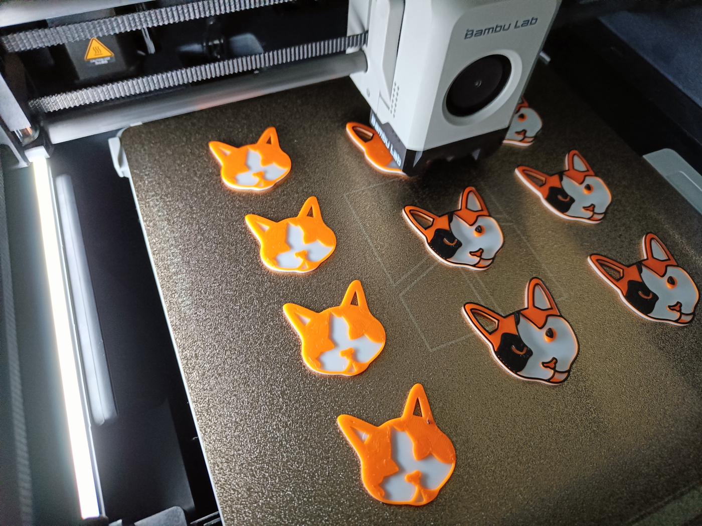

Powiem szczerze, że przeraziło mnie to, gdy zorientowałem się, że od publikacji ostatniego artykułu minęło prawie 2 lata. Niestety, ale przez przeprowadzkę, problemy zdrowotne w rodzinie oraz inne prywatne sprawy nie miałem, ani czasu, ani chęci kontynuować tego projektu. Dlatego dzisiejsza publikacja ma charakter informacyjny, ponieważ postanowiłem zmienić lekko tematykę tego bloga, aby móc pokazać Wam moje nowe hobby, jakim jest druk 3D.

Jesienią zeszłego roku po wielu wahaniach nabyłem w końcu drukarkę 3D - Bambu Lab P1S. Po wielu latach chałupniczego tworzenia obudów i innych akcesoriów do moich projektów DIY nareszcie mogę wymodelować i wydrukować dedykowany dla siebie element. Koniec z szlifowaniem, cięciem i wierceniem w sklejkach czy plastikach. To otworzyło przede mną zupełnie nowe drogi rozwoju i od tamtej pory regularnie udzielam się w internecie publikując własne modele 3D. Zanim opowiem Wam o dalszym losie Redarka, pozwólcie, że zaprezentuję mój obecny warsztat, opowiem dlaczego zdecydowałem się na produktu od Bambu i gdzie obecnie możecie mnie znaleźć.

## Zakup drukarki

Początkowo skłaniałem się ku modelowi Creality K1. Drukarka cechowała się popularnością zbliżoną do Bambu i oferowała oprogramowanie open-source, co w przypadku moich zamiłowań do modyfikacji i pisania integracji z obecnym smart home, było dla mnie plusem. Jednak po wykonaniu głębszego researchu zacząłem spotykać się z coraz większą ilością negatywnych opinii o wadach konstrukcyjnych tego modelu oraz częstych problemach z oprogramowaniem. Dodatkowo na tamten dzień Creality nie ogłosiło jeszcze żadnego rozwiązania pozwalającego drukować w wielu kolorach, które to Bambu Lab już od dawna opanowało.

<ImageDescription>
  Kocie breloki podczas wydruku przez Bambu Lab P1S
</ImageDescription>

Ostatecznym gwoździem do trumny modelu K1 było odkrycie platformy [Maker World](https://makerworld.com/en) oraz innych portali stworzonych przez deweloperów Bambu Lab. Maker World jest to platforma do dzielenia się stworzonymi modelami 3D podobna do popularnego Printables lub Thingiverse, ale oczywiście z naciskiem na integracje z modelami drukarek tego producenta. Naprawdę widać tam dopracowanie i dbałość twórców o swoją społeczność. Dodatkowo organizowane są tam liczne konkursy wraz z nagrodami pieniężnymi oraz system zbierania punktów za rozwój platformy, które można później wymienić na filamenty i części zamienne w ich sklepie. Ponadto, w ramach programu ekskluzywnych modeli dostępnych tylko na platformie Maker World, zdobyte punkty można wymienić nawet na prawdziwe pieniądze.

Po podsumowaniu wszystkich za i przeciw postanowiłem zakupić model P1S wtedy jeszcze bez modułu AMS. Ten dokupiłem osobno kilka miesięcy po zakupie drukarki - tak, trochę się wkręciłem 😅. Od tamtej pory regularnie udzielam się na platformie [Maker World](https://makerworld.com/en/@adan2013/upload), tworzę własne modele i testuje rozwiązania innych. Moja P1S ma już przepracowane koło 500 godzin, a wciąż mam pełną listę oczekujących wydruków.

## Rebranding Redarka

Aby móc jeszcze wrócić do publikowania tutaj treści postanowiłem dokonać lekkiego rebrandingu Redarka i poświęcić go bardziej mojemu nowemu hobby: druku 3D oraz projektach DIY. Nie ma co ukrywać, że temat komputerów już się u mnie wyczerpał. Recenzje i inne poradniki nie cieszyły się dużą popularnością, a w obecnych czasach AI i generowania treści w kilka sekund nie ma sensu starać się reanimować portalu w takiej samej formie jak dotychczas.

Redark otrzymał nowe logo, bardziej skupione na druku i modelowaniu 3D, a główna aktywność będzie się teraz pojawiać na jego portalach społecznościowych, gdzie będę pokazywać Wam moje wydruki oraz postęp w projektach. Blog nadal pozostanie dostępny w takiej formie, jak obecnie, ale już bez presji regularnego publikowania tutaj artykułów. Nowe publikacje będą pojawiać się tutaj tylko wtedy, gdy ukończę duży projekt DIY i uznam, że warto udokumentować proces jego powstawania artykułem - tak jak to miało miejsce z [zegarami do ETS/ATS](/diy-arduino-dashboard-ets-ats) czy [komputerem ukrytym w VHS-ie](/vhs-htpc-project).

Dzięki wszystkim, którzy tu jeszcze pozostali i zapraszam do obserwowania moich sociali.
